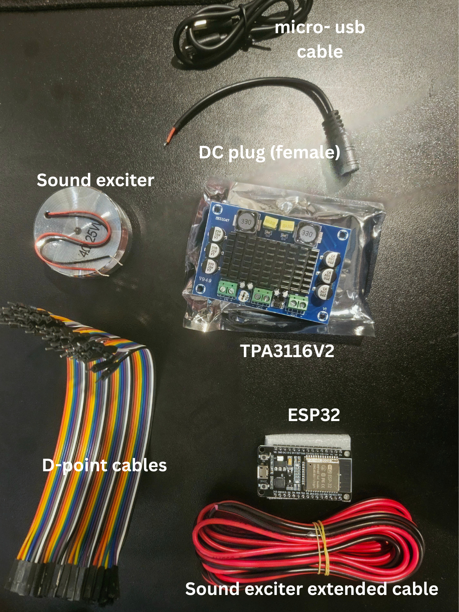
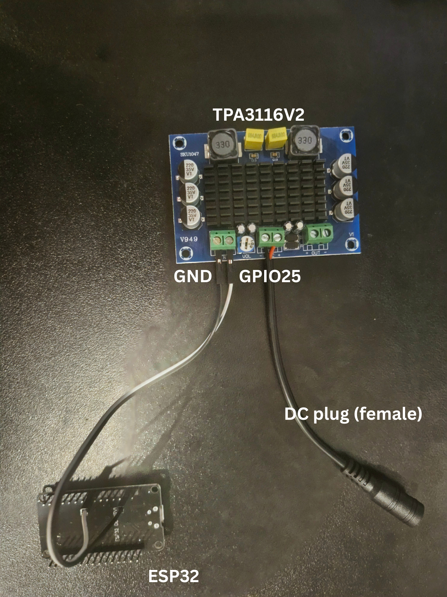
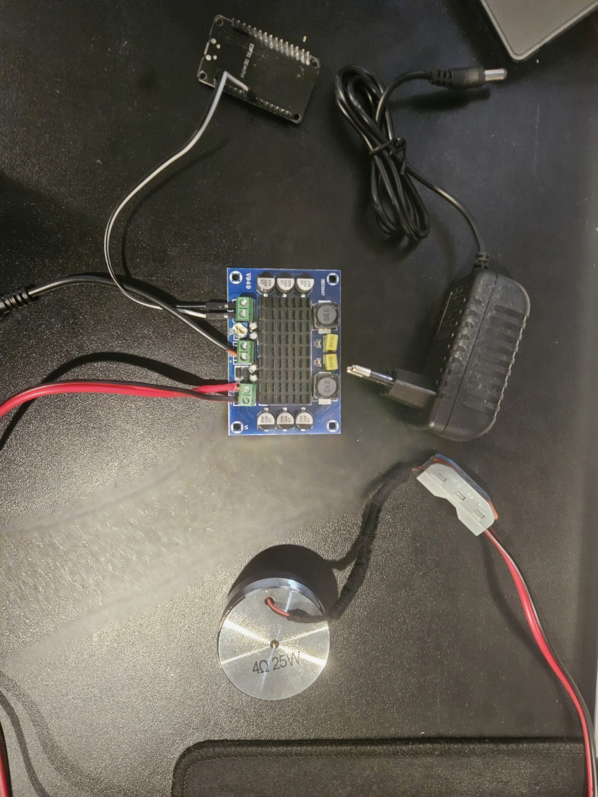

# 16/8/2026

**Today arrived items** :
- ESP32-DEVKIT-V1
- TPA3116V2 (XH-M542)
- DC jack (female)
- Sound exciter extended cable
- Micro-usb cable
- D-point cables

## Today works :

- Connecting ESP32 and the amply through D-point cables
- Connecting the female DC jack with TPA3116V2

# 18/8/2026

**Today arrived items** :
- DC 12V - 3A cable
- 40mm bass transducer
- Amplifier case
- Wire connector

## Today works :

### Connected all of the components.

### Testing 

- ABS with Amplitude modulation (60Hz - 12Hz) : [Here](Videos/1882026-AM.mp4)
- **Comment** : Weak intensity even at max amplitude due to the sound exciter's physical limitations. 

# 21/8/2026

**Today arrived items** : Nothing yet
## Today works :

### Complete the firmware for ESP32

### Testing all effects

- Demo video (ABS) : [Here](Videos/abs.mp4)
- Demo video (slip effect) : [Here](Videos/slip_effect.mp4)
- Demo video (road effect) : [Here](Videos/road_effect.mp4)

