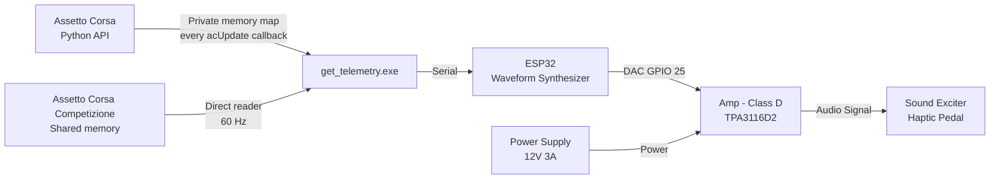
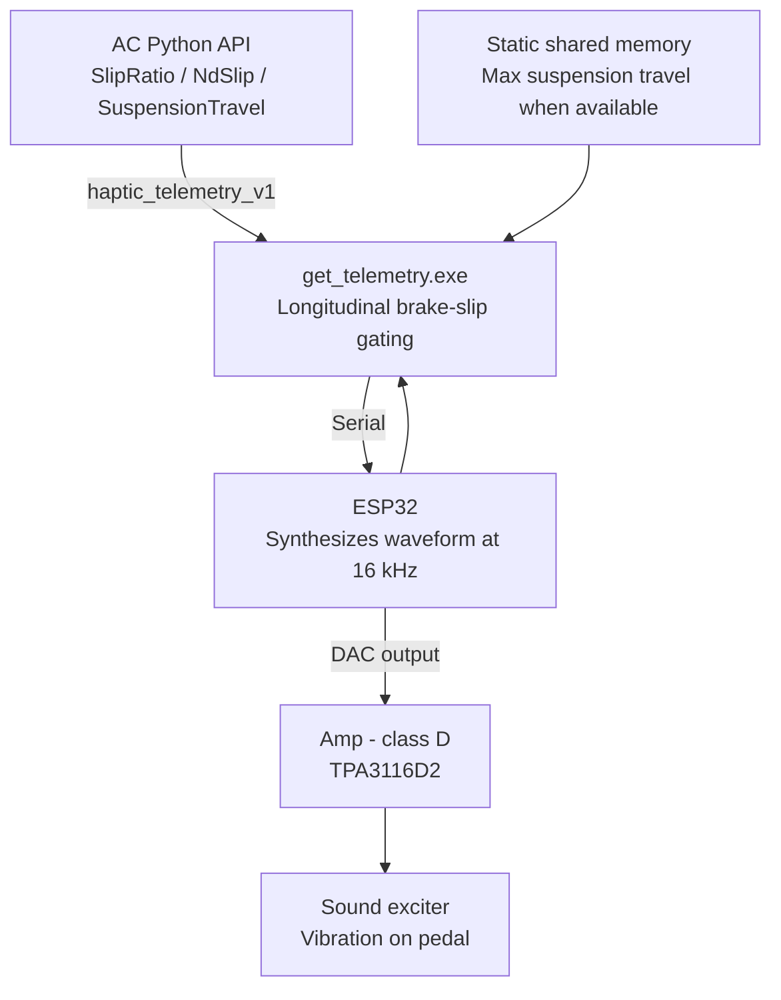
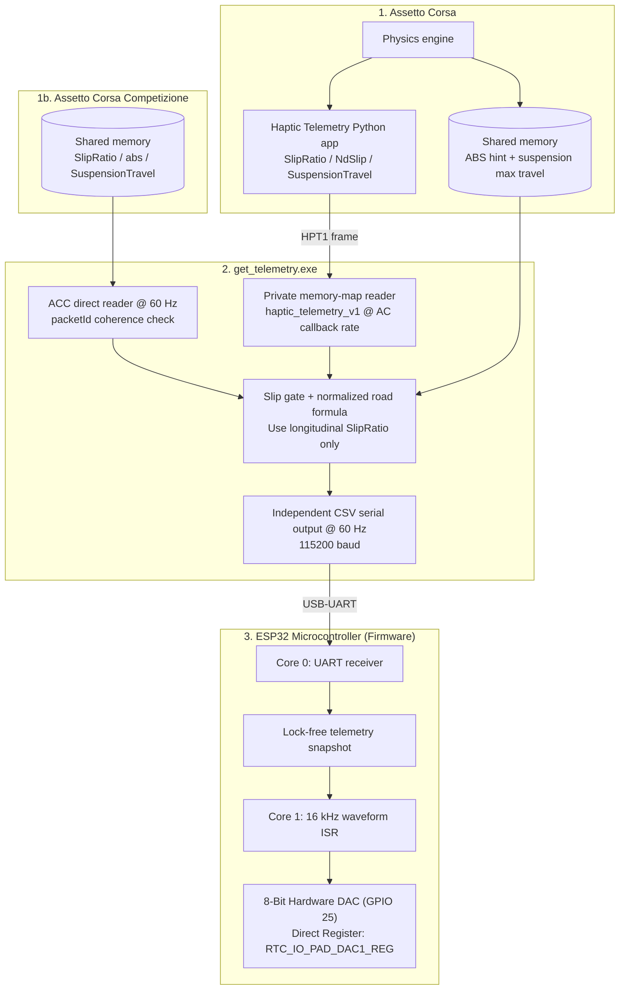

# Overview 

Sim racing pedals use load cells to provide accurate brake force, but they cannot replicate the tactile cues a driver feels in a real car - the pulsing of ABS engaging, the judder of locked wheel or the vibration from road texture. Without these cues, trail-braking near the limit becomes a guessing game based on the HUD or wheel feedbacks, which is far slower to react to than real-life sensation.

This project is a DIY guide to building a haptic feedback system for sim racing pedals, using a custom controller to simulate **ABS pulse** and **road effect** - on the brake pedal - restoring the tactiles information that a real car's brake pedals would provide.


# Existing solutions and why a custom approach

| Criteria | Eccentric motor (ERM) | Soundcard + bass shaker | This project (ESP32 + exciter) |
|---|---|---|---|
| **Cost** | Low | High | Low |
| **Response speed** | Slow (motor needs time to spin up/down) | Instant | Instant (Fastest) |
| **Vibration range** | Narrow, limited control | Wide, full control over frequency and amplitude | Acceptable, good enough for the target effects |
| **Safety** | Safe | Risk of damaging the laptop's soundcard or onboard audio circuit | Fully safe (isolated from the PC) |

**Eccentric motor (ERM):** This is the cheapest and simplest option. The motor spins to create vibration, but it takes time to speed up and slow down. This delay makes it feel slow and less precise, and the vibration only has one basic pattern, so it cannot represent different effects (ABS, road texture, etc.) very well.

**Soundcard + bass shaker:** This gives the best result. It reacts instantly and can produce almost any frequency and amplitude, so it can simulate many different effects clearly. But it usually needs a dedicated soundcard, which is expensive. It also carries a risk: if wired incorrectly or if there is a short circuit, it can send too much current back into the laptop's audio output or damage the onboard soundcard.

**This project:** Uses an ESP32 with its own DAC to generate the signal, and a separate class D amplifier to drive the exciter. Thus, it guarantees the latency within a predictable range (more consistent than soundcard-based system due to RTOS's property) and keeps the cost low (similar to the eccentric motor option). The vibration range is not as wide as a full soundcard setup, but it is enough to clearly represent the target effects (ABS, lock-up, road feel). Because the signal is generated on a separate microcontroller (not the PC's own soundcard), there is no risk of damaging the laptop's audio hardware.


# System architecture

- **Signal path** - Assetto Corsa uses the bundled Python app to publish physical `SlipRatio` and suspension data through `haptic_telemetry_v1`. Assetto Corsa Competizione needs no Python app: `get_telemetry.exe` reads its extended shared-memory physics page directly. Both paths are normalized to the same five-field serial packet, and the ESP32 synthesizes waveforms at 16 kHz through its internal DAC (GPIO 25).


# Supported features
- **Supported games** - Assetto Corsa (Python telemetry bridge) and Assetto Corsa Competizione (direct shared memory, automatically detected).
- **ABS Feedback** -- When ABS intervenes, it pulses the brakes rapidly via a hydraulic modulator to prevent wheel lock-up. This causes the pedal to judder/vibrate.
- **Lock-up / Tire Slip** -- When the car locks up or the tires slip, kinetic friction between the tires and the road generates vibration that travels back through the suspension and chassis to the seat and pedals. To simplify this effect, this motor simulates a similar vibration pattern to what is felt at the seat, but at a weaker intensity.
- **Road Effect** - When the front tires hit a kerb, gravel, or debris, the impact vibration travels back through the pedals in a real car. This system derives that sensation from the normalized vertical speed of the front suspension.

# Design rationale and control logic




**Pipeline stages:**

1. **AC Python app** - `assetto_corsa_python_app/haptic_telemetry` runs only inside Assetto Corsa and publishes on every `acUpdate()` callback. It accesses the explicitly named `SlipRatio`, `NdSlip`, and `SuspensionTravel` channels, avoiding interpretation of AC's undocumented shared-memory `wheelSlip` field as a physical longitudinal slip ratio. The callback rate is controlled by AC and is not necessarily equal to rendered FPS.
2. **ACC direct reader** - no Python app is required. The host polls ACC's `SPageFilePhysics` at 60 Hz, using front `slipRatio`, `suspensionTravel`, and the native `abs` intervention signal. Serial output runs independently at 60 Hz, so USB writes cannot stall shared-memory capture.
3. **`get_telemetry.exe`** - automatically detects AC or ACC, validates coherent frames, gates longitudinal slip to braking above 3 km/h, and normalizes road input. `acpmf_static.suspensionMaxTravel` is used when valid; otherwise the road calculation falls back to `0.10 m`.
4. **ESP32** - receives the relevant values over serial, applies the effect logic (priority, weighting, carrier-modulation as described in Design Rationale), and continuously synthesizes a waveform sample-by-sample, output through its internal DAC.
5. **Class D amp (TPA3116D2)** - amplifies the low-power DAC signal enough to drive the exciter.
6. **Sound exciter** - converts the amplified electrical signal into physical vibration felt through the pedal.


## Telemetry pre-processing: signal smoothing (LERP vs. EMA)

To prevent harsh, stepped vibrations caused by frame-to-frame telemetry updates, raw telemetry values are smoothed before generating waveforms:

- **LERP (Linear Interpolation):** Requires a strictly fixed arrival interval between data packets. Because Windows is not a real-time OS, packets can arrive with slight timing delays (e.g., 12 ms instead of 8.33 ms). This causes fixed-step LERP to finish too early or freeze, creating noticeable stutter.
- **EMA (Exponential Moving Average):** Calculates new values recursively using only the current reading and the previous smoothed state. It runs independently of packet arrival timing, eliminating jitter. Furthermore, EMA creates a more natural feel because physical systems like brake fluid pressure and suspension damping naturally follow exponential decay curves (first-order dynamic response).

**Mathematical Formulation:**

The discrete first-order Exponential Moving Average (EMA) filter is defined as:

$$y[n] = y[n-1] + \alpha \cdot \big(x[n] - y[n-1]\big)$$

**Implementation in this project (Weighted ABS Intensity):**

$$\text{Target}_{\text{ABS}}[n] = \begin{cases} 
w_{\text{ABS}} \cdot \text{brakeVal}[n] & \text{if } \text{absVal} = 1 \\
0 & \text{if } \text{absVal} = 0 
\end{cases}$$

$$y[n] = y[n-1] + 0.01131 \cdot \Big(\text{Target}[n] - y[n-1]\Big)$$

Where:
- $y[n]$: Smoothed amplitude at interrupt step $n$.
- $y[n-1]$: Smoothed state from the preceding $62.5\ \mu\text{s}$ timer interrupt cycle.
- $\text{Target}[n]$: Target demand from PC.
- $\alpha = 0.01131$: Smoothing factor calibrated for $95\%$ convergence within one 60 Hz telemetry frame.


### Step response over 266 interrupt cycles ($0 \rightarrow 100\%$ step)


| Interrupt Step ($n$) | Elapsed Time ($t$) | Amplitude ($y[n]$) | Physical / Tactile Behavior |
| --- | --- | --- | --- |
| **$n = 0$** | $0.00\text{ ms}$ | **$0.00\%$** | New 60 Hz telemetry packet arrives via Serial. |
| **$n = 1$** | $0.06\text{ ms}$ | **$1.13\%$** | First tiny step ($62.5\ \mu\text{s}$), removing harsh 90° square edges. |
| **$n = 16$** | $1.00\text{ ms}$ | **$16.63\%$** | Smooth vibration ramp-up within the first 1 ms. |
| **$n = 64$** | $4.00\text{ ms}$ | **$51.70\%$** | Passes 50% amplitude - driver foot senses the effect. |
| **$n = 88$** | $5.50\text{ ms}$ | **$63.22\%$** | Reaches standard time constant $1\tau$ ($63.2\%$). |
| **$n = 128$** | $8.00\text{ ms}$ | **$76.62\%$** | Reaches nearly 80% strength halfway through the frame. |
| **$n = 192$** | $12.00\text{ ms}$ | **$88.72\%$** | Smooth asymptotic curve, preventing abrupt jerks. |
| **$n = 256$** | $16.00\text{ ms}$ | **$94.55\%$** | Reaches standard convergence threshold (~95.0%). |
| **$n = 266$** | **$16.63\text{ ms}$** | **$95.16\%$** | Seamlessly completes 1 frame ($16.67\text{ ms}$) as the next packet arrives. |


After analyzing various $\alpha$ values, $\alpha = 0.01131$ was chosen because it allows the step response to reach $\approx 95\%$ convergence within a single 60 Hz telemetry frame ($16.67\text{ ms}$), smoothly eliminating discrete steps without introducing perceptible latency.

**[21/8/2026 Update - Fixing floating point]**
- When using EMA smoothing with a very small $\Delta$ (where $\Delta = |\text{Target}[n] - y[n-1]|$), it may cause ESP32 fatal panics, so the $\Delta$ is limited to $\Delta \ge 10^{-4}$.

## Effect calculations
1. **ABS:** In real life, ABS pulse is caused by the hydraulic modulator releasing and reapplying brake pressure rapidly 10–15 times per second (Bosch Automotive Handbook), so the frequency is set to 12 Hz, which is the sweet spot for ABS. Because sound exciters have poor low-frequency response at 12 Hz, Amplitude Modulation (AM) is used - modulating a 60 Hz carrier wave with a 12 Hz sine envelope to maximize tactile feedback strength while preserving the realistic frequency. Since `absVal` is a boolean telemetry flag (0 or 1), driver brake pedal pressure (`brakeVal`) is used to scale the vibration amplitude dynamically:

~~$$y_{\text{carrier}}(t) = \sin(2\pi \cdot 60 \cdot t)$$~~
~~$$y_{\text{mod}}(t) = \sin(2\pi \cdot 12 \cdot t)$$~~

~~$$\Rightarrow y(t) = \left( \frac{1 + \sin(2\pi \cdot 12 \cdot t)}{2} \right) \cdot \sin(2\pi \cdot 60 \cdot t)$$~~

~~$$\text{DAC}(t) = 128 + (105 \cdot \text{brakeVal}) \cdot y(t)$$~~

~~**Note:** `brakeVal` is the normalized brake pedal pressure ($0.0 \le \text{brakeVal} \le 1.0$) from telemetry, `y(t)` is the modulated signal, and `DAC(t)` is the 8-bit value sent to the DAC.~~

*(Deprecated - see the 18/8/2026 Update below for the revised approach)*

**[18/8/2026 Update - Square-Wave Pulse Gating]:**

However, physical testing revealed that the continuous sine AM formula produced a soft, mushy vibration due to the mechanical limits of the sound exciter. To achieve crisp and punchy kicks, the continuous modulation was replaced with **square-wave pulse gating (12 Hz, ~65% Duty Cycle)**:

$$E_{\text{ABS}}(t) = \begin{cases} 
1 & \text{if } \left(t \bmod \frac{1}{12}\right) \le 3  \cdot \frac{1}{60} \quad (\approx 50\text{ ms ON}) \\
0 & \text{if } \left(t \bmod \frac{1}{12}\right) > 3 \cdot \frac{1}{60} \quad (\approx 33.33\text{ ms OFF})
\end{cases}$$

$$\Rightarrow y_{\text{ABS}}(t) = E_{\text{ABS}}(t) \cdot \sin(2\pi \cdot 60 \cdot t)$$

$$\text{DAC}_{\text{ABS}}(t) = 128 + (105 \cdot \text{absVal}) \cdot y_{\text{ABS}}(t) \quad (\text{active when } \text{absVal} = 1)$$

This ~60:40 duty cycle (50 ms ON / 33.33 ms OFF) maintains the realistic 12 hydraulic cycles per second of an ABS system while delivering sharp, instantaneous tactile impacts to the pedal.

**[22/8/2026 Update - ABS data]:**
For Assetto Corsa, the shared-memory `abs` field is not treated as a moment-by-moment activation flag. ABS onset is derived from the Python API's front longitudinal slip ratios; the shared-memory field only confirms availability and optionally supplies a plausible `0.03..0.30` threshold. For Assetto Corsa Competizione, the host uses the native shared-memory `abs` intervention signal directly, so no inferred ABS threshold is required. ACC's later `absInAction` compatibility field is not used because the game does not populate it.

$$\text{absVal} = (\text{brake} > 0.05 \ \land \ \text{speed} > 3\text{ km/h} \ \land \ \text{ABS enabled} \ \land \ \max(|\kappa_{FL}|, |\kappa_{FR}|) \ge \kappa_{ABS})$$


2. **Road Effect:**
When a front tire hits road texture, a bump, or a kerb, its suspension travel changes rapidly. A raw metre-per-frame threshold behaves very differently between cars and was too insensitive at 60 Hz, so the PC now divides the travel change by both elapsed time and the current car's maximum suspension travel:

$$v_{\text{road},i}(t) = \frac{|\text{Sus}_i(t)-\text{Sus}_i(t-1)|}{\text{SusMax}_i \cdot \Delta t}, \qquad i \in \{FL,FR\}$$

$$R(t) = \min\left(1,\max(v_{\text{road},FL}(t),v_{\text{road},FR}(t))\right)$$

$$A_{\text{road}}(t) = 70R(t)$$

$$\text{DAC}_{\text{road}}(t) = A_{\text{road}}(t) \cdot \sin(2\pi \cdot 75 \cdot t)$$

`SusMax` comes from `Local\acpmf_static.suspensionMaxTravel`; the host falls back to `0.10 m` if the value is absent, invalid, or not populated by ACC. `R=1` means motion equivalent to one full suspension travel per second, not one full travel in a single frame. The ESP32 applies asymmetric EMA smoothing (`0.01131` attack, `0.0038` release) to keep kerb impacts crisp without an abrupt pop.

3. **Lock-up / Longitudinal Brake Slip:**
The input is the physical longitudinal slip ratio: the Python API's `SlipRatio` channel in AC and shared-memory `slipRatio[FL,FR]` in ACC. Shared-memory `wheelSlip` is not used. The effect is gated by brake input, so controlled lateral sliding and drift do not activate the pedal. A light warning starts at 3% longitudinal slip, before wheel lock, then becomes progressively stronger through the tyre-limit region and toward the full-lock reference at ratio 1.0.

$$
\begin{aligned}
\text{Slip}_{\text{front}}(t) &= \max\Big(\text{slipL}(t), \ \text{slipR}(t)\Big) \\
\text{DAC}_{\text{slip}}(t)   &= 128 + A_{\text{slip}}(t) \cdot \sin(2\pi \cdot rand(50, 90) \cdot t)
\end{aligned}
$$

Where the amplitude $A_{\text{slip}}(t)$ is defined by the piecewise mapping function:

$$
A_{\text{slip}}(t) = \begin{cases} 
0 & \text{if } \text{Slip}_{\text{front}} < 0.03 \\
8 + 12 \cdot \frac{\text{Slip}_{\text{front}}-0.03}{0.07} & \text{if } 0.03 \le \text{Slip}_{\text{front}} < 0.10 \\
20 + 25 \cdot \frac{\text{Slip}_{\text{front}}-0.10}{0.15} & \text{if } 0.10 \le \text{Slip}_{\text{front}} < 0.25 \\
45 + 40 \cdot \frac{\text{Slip}_{\text{front}}-0.25}{0.75} & \text{if } 0.25 \le \text{Slip}_{\text{front}} \le 1.00 \\
85 & \text{if } \text{Slip}_{\text{front}} > 1.00
\end{cases}
$$

**Note :** 50Hz and 90Hz is the chosen frequency based on previous sim racing DIY builders' experience and physical testing. The sine wave frequency is randomized by `xorshift32()` function.

## Tire slip mapping and perception breakdown

| Slip Value ($\text{Slip}_{\text{front}}$) | State | Amplitude | Tactile feedback |
|---|---|---|---|
| **$0.00 \le \text{Slip} < 0.03$** | Rolling / telemetry noise | **0** | Deadband; pedal stays smooth. |
| **$0.03 \le \text{Slip} < 0.10$** | Early longitudinal slip | **8 to 20** | Light warning before the wheel approaches lock. |
| **$0.10 \le \text{Slip} < 0.25$** | Tyre-limit / ABS region | **20 to 45** | Clearly increasing warning. |
| **$0.25 \le \text{Slip} \le 1.00$** | Heavy slip toward lock-up | **45 to 85** | Strong warning to release brake pressure. |
| **$\text{Slip} > 1.00$** | Clamped extreme input | **85** | Maximum output without telemetry spikes consuming headroom. |


## Signal mixing and headroom management

When multiple effects happen at the same time (for example, braking under ABS while crossing a kerb), their instantaneous samples are added:

$$y_{\text{total}}(t) = y_{\text{ABS}}(t) + y_{\text{Road}}(t) + y_{\text{Slip}}(t)$$

Each effect has a different native maximum amplitude, so the firmware uses one normalization factor per effect instead of a single shared headroom multiplier:

$$w_{\text{ABS}} = \frac{1}{120}, \qquad
w_{\text{Road}} = \frac{1}{70}, \qquad
w_{\text{Slip}} = \frac{1}{85}$$

The values below are the intended peak DAC-amplitude allocations. The lookup table stores each allocation multiplied by its corresponding normalization factor; for example, an ABS allocation of 85 is stored as $85 \cdot w_{\text{ABS}}$, so the original 120-count ABS waveform contributes at most 85 counts.

| State (bits 2,1,0) | Active effects | ABS allocation | Road allocation | Slip allocation | Maximum sum |
| :---: | :--- | ---: | ---: | ---: | ---: |
| `000` | None | 0 | 0 | 0 | 0 |
| `001` | ABS only | 120 | 0 | 0 | 120 |
| `010` | Road only | 0 | 70 | 0 | 70 |
| `011` | ABS + Road | 85 | 40 | 0 | 125 |
| `100` | Slip only | 0 | 0 | 85 | 85 |
| `101` | ABS + Slip | 90 | 0 | 35 | 125 |
| `110` | Road + Slip | 0 | 50 | 75 | 125 |
| `111` | ABS + Road + Slip | 75 | 30 | 20 | 125 |

The ESP32 DAC is centered at 128 and has 127 counts of usable peak headroom. Every combined-effect row is therefore limited to 125 counts, leaving a two-count margin before clipping. The actual instantaneous sum is normally lower because the 60 Hz ABS carrier, 75 Hz road waveform, and randomized 50/90 Hz slip waveform do not generally reach their peaks at the same time.


# Hardware implementation
- ESP32 DevKit V1 - microcontroller that receives telemetry from the PC through get_telemetry() and generates the control waveform
- TPA3116D2 - class D amplifier, drives the sound exciters
- Sound exciter - 4Ω 25W, resonance frequency ~60Hz - converts the amplified signal into physical vibration (see spec/frequency response note below)
- DC 12V 3A power supply - powers the amplifier
- 5.5mm x 2.1mm DC jack (female)

**Note:** The selected exciter has a rated frequency response of ~60Hz–20kHz (resonance frequency 60Hz ±20%), with SPL relatively stable between 20–150Hz and a dip around 300Hz–1kHz. Since target effects (e.g. ABS pulsing at 10–15Hz) fall below the exciter's effective operating range, a carrier-modulation approach was used instead of direct low-frequency playback (see Design Rationale).


## Calibrated operating limit

The output limit below was measured on the assembled system, not inferred from the amplifier's advertised maximum power:

- Amplifier board: XH-M542 / TPA3116D2 mono
- Power supply: 12 V DC, 3 A
- Exciter: nominal 4 ohm, marked 25 W
- Calibration signal: continuous 60 Hz sine wave
- Amplifier volume: maximum and unchanged between measurements
- Measurement point: directly across `OUT+` and `OUT-`, with the exciter connected

| Master gain | Measured output | Estimated power into nominal 4 ohm |
| ---: | ---: | ---: |
| `0.50` | 3.6 Vrms | 3.2 W |
| `0.70` | 5.2 Vrms | 6.8 W |
| `0.80` | 6.0-6.1 Vrms | 9.0-9.3 W |

The power estimates use:

$$P \approx \frac{V_{\text{RMS}}^2}{R}$$

Because 4 ohm is the exciter's nominal impedance and its actual impedance varies with frequency, these values are engineering estimates rather than laboratory power measurements.

For this exact hardware configuration, the calibrated continuous-output safety limit is:

$$\text{MASTER\_GAIN} \le 0.80, \qquad V_{\text{OUT}} \le 6.1\text{ Vrms at 60 Hz}$$

This corresponds to approximately 9.3 W using the nominal 4-ohm value. The 25 W marking is not used as a continuous sine-wave target: the exciter becomes noticeably warm during sustained resonant operation, and its exact continuous thermal rating is not documented. The amplifier board's advertised 100 W figure also does not apply to this 12 V / 3 A supply configuration.

The continuous 60 Hz calibration tone is a more severe thermal load than normal firmware output, where ABS is pulse-gated and multiple effects do not remain at their maximum allocations continuously. Even so, long-duration testing must be supervised. Stop immediately if temperature continues rising without stabilizing, vibration becomes distorted, or there is any smell from the coil, adhesive, wiring, or amplifier.

The TPA3116D2 output is BTL. Voltage must be measured between `OUT+` and `OUT-`; neither speaker terminal may be connected to ESP32 ground, USB ground, or power-supply ground. Attach meter probes with power off, select AC voltage mode, and never use resistance or current mode on an energized output.


# Firmware/software implementation


## Software
- GUI version : get_telemetry.exe


- C++ was used for best performance and reduce packet loss or late data transfer when sending the game telemetry data to ESP32

### Installation and startup

For **Assetto Corsa**:

1. Copy `assetto_corsa_python_app/haptic_telemetry` to `<Assetto Corsa>/apps/python/haptic_telemetry`.
2. Enable **Haptic Telemetry** in Assetto Corsa or Content Manager's Python Apps settings.
3. Start a driving session, run `get_telemetry.exe`, and click **CONNECT**. The app scans the available COM ports and connects only to the ESP32 that identifies itself as a haptic controller.
4. Confirm that the GUI shows `ESP32: [AUTO CONNECTED] COMx - <device ID>` and `AC Python API: [RECEIVING]`. `Stream` reports AC's actual Python `acUpdate()` callback rate; serial output to the ESP32 remains fixed at 60 Hz.

For **Assetto Corsa Competizione**, no Python app or UDP configuration is required. Start a driving session, open `get_telemetry.exe`, and connect the ESP32. The GUI should show `ACC Shared Memory: [RECEIVING]`. The displayed Stream value counts distinct valid simulator packets captured by the 60 Hz reader; it is not the game's rendered FPS.

The host automatically distinguishes `acs.exe` from `AC2-Win64-Shipping.exe`/`acc.exe`. If either telemetry source stops for more than 250 ms, the PC app sends zeros to silence the motor. The ESP32 independently silences its output after 500 ms without a valid serial packet.


### Assetto Corsa Python API bridge
Install `assetto_corsa_python_app/haptic_telemetry` into Assetto Corsa's `apps/python` directory and enable **Haptic Telemetry**. The in-game app publishes the following `HPT1` fields through `haptic_telemetry_v1`:

| Field | Source | Usage |
|---|---|---|
| `brake` | `acsys.CS.Brake` | Gates all longitudinal brake-slip effects |
| `speedKmh` | `acsys.CS.SpeedKMH` | Suppresses low-speed telemetry noise |
| `slipRatio[FL, FR]` | `acsys.CS.SlipRatio` | ABS and lock-up detection |
| `ndSlip[FL, FR]` | `acsys.CS.NdSlip` | Diagnostic only; never drives the brake pedal |
| `suspensionTravel[FL, FR]` | `acsys.CS.SuspensionTravel` | Input to normalized suspension-velocity road effect |

`get_telemetry.exe` opens `Local\acpmf_physics` only for the ABS enabled/configuration hint and `Local\acpmf_static` for `suspensionMaxTravel`. It does not read shared-memory `wheelSlip` for haptic output.

### Assetto Corsa Competizione direct bridge

ACC is read directly from its extended `Local\acpmf_physics` page using the layout in `get_telemetry/structed_file_ACC.h`:

| Field | Usage |
|---|---|
| `brake`, `speedKmh` | Brake and low-speed gates |
| `slipRatio[FL, FR]` | Longitudinal slip feedback |
| `abs` | Native ABS intervention signal (`0.0` inactive, `1.0` active) |
| `suspensionTravel[FL, FR]` | Normalized road effect |

The reader checks `packetId` before and after copying a frame to reject torn shared-memory reads. ACC's legacy `wheelSlip` and unused `absInAction` fields are not used for haptic activation.

### Serial protocol
Data is formatted as a CSV string and transmitted at **115200 baud, 8-N-1** over USB-UART.

```text
absVal,slipRatioFL,slipRatioFR,roadIntensityFL,roadIntensityFR\n
```

### Automatic ESP32 discovery

The ESP32 has a stable eFuse MAC identifier. On every connection attempt, the PC app opens each available COM port with DTR/RTS disabled, sends the following request, and keeps only the port that returns the expected protocol prefix:

```text
PC   -> ID?\n
ESP32 -> HAPTIC_PEDAL,1,<12-digit-eFuse-MAC>\n
```

For example, `HAPTIC_PEDAL,1,00C4D2BD2A58` is a valid wire response. This means COM port numbering may change after reconnecting USB without requiring the user to select a port manually.


## Firmware

### Dual-core architecture
1. **Core 0 - UART receiver:** The `serial_read` task initializes `Serial` and receives telemetry packets. Initializing the UART driver from this pinned task allocates its UART interrupt on Core 0, then publishes a coherent telemetry snapshot for the waveform engine.
2. **Core 1 - waveform engine:** `setup()` creates the GPTimer on Core 1. Its 16 kHz ISR generates ABS, slip, and road waveforms, then writes the DAC output on GPIO 25.

Keeping the UART ISR on Core 0 and the GPTimer ISR on Core 1 prevents the high-rate timer callback from competing with UART receive interrupts on the same shared interrupt path when the PC starts streaming telemetry.


### Lock-free telemetry snapshot

Three `volatile float` values (`cur_absVal`, `road_intensity`, `cur_slip`) are shared between the Core 0 serial task and the Core 1 timer ISR. A single-writer sequence lock keeps the three values in one coherent snapshot without taking another `portMUX` from inside the GPTimer shared interrupt handler.

```cpp
// Core 0 writer: odd means updating, even means ready.
__atomic_add_fetch(&telemetry_sequence, 1, __ATOMIC_SEQ_CST);
cur_absVal = absVal;
road_intensity = max(roadL, roadR);
cur_slip   = max(slipL, slipR);
__atomic_add_fetch(&telemetry_sequence, 1, __ATOMIC_SEQ_CST);

// Core 1 ISR: accept values only when the sequence is unchanged and even.
uint32_t before = __atomic_load_n(&telemetry_sequence, __ATOMIC_SEQ_CST);
local_absVal    = cur_absVal;
local_road_intensity = road_intensity;
local_slip      = cur_slip;
uint32_t after  = __atomic_load_n(&telemetry_sequence, __ATOMIC_SEQ_CST);
```

The ISR retries at most three times and otherwise reuses its last valid snapshot, so it cannot spin indefinitely. This removes nested spinlock operations while retaining a 62.5 microsecond ISR period (16 kHz).


### UART data validation
1. `isfinite()` check - Rejects `NaN`, `+Inf`, `-Inf` values that can result from UART byte corruption (e.g., partial packet, electrical noise). This prevents invalid floating-point values from propagating into the waveform synthesis math, where they would cause undefined behavior or crash.

2. Range validation - Rejects packets unless `absVal` is in `0..1`, each longitudinal slip ratio is in `0..2.01`, and each normalized road intensity is in `0..1.001`.

3. Identity handshake - `ID?` is handled before CSV parsing and returns the immutable ESP32 eFuse MAC with the `HAPTIC_PEDAL,1,` prefix. It does not alter the haptic telemetry or watchdog state.


### Status indicator and watchdog
1. LED ON (GREEN): Set `HIGH` when a valid, fully-parsed 5-field packet passes both validation checks.
2. LED OFF (RED): Set `LOW` when no valid packet has been received for $> 500\text{ms}$, indicating USB disconnection or data loss. The watchdog also zeros all shared variables to silence the motor

### Performance and resources
1. The firmware is lightweight and uses only a small amount of RAM for telemetry state, lookup tables, and global variables.
2. Memory usage is minimal, with only a few kilobytes of RAM used for storing telemetry data and global variables.
3. Although sinf(x) is O(1) time complexity, using it still costs a lot of CPU resources and time to solve, so a LUT (Look-up table) is used to reduce the CPU usage and calculation time. Also, when using a high sample rate such as 16000Hz, using the sinf(x) function may cause floating point errors and return incorrect data. Therefore, using LUT is more stable and efficient for generating waveforms. LUT formula : the circle is divided into 1024 parts, so the angle will be : $\theta = 2\pi \cdot \frac{i}{1024}$, so $\sin \theta = \sin(2\pi \cdot \frac{i}{1024})$ where $i$ is the index of the LUT. And a sine wave step after a single sampling is calculated by $\frac{\text{frequency} \times 1024}{\text{sample rate}}$. For example, ABS at 60Hz with 16000Hz sample rate : $\frac{60 \times 1024}{16000} = 3.84$.

4. Because the hardware timer interrupt runs from internal RAM (`IRAM_ATTR`), using `<cmath>` library functions (like `fminf`, `fabsf`, `fmaxf`, etc.) can cause the ESP32 to crash. These functions are stored in external SPI Flash, and accessing them during an interrupt when the flash cache is disabled will result in a fatal panic. Therefore, basic conditional statements are used instead.


## How it works




# Results and demo

**See here :** [BUILD_LOG.md](BUILD_LOG.md)


# Academic and technical references

1. **ABS Hydraulic Cycling Benchmark (10–15 Hz):**
   - **Bosch Automotive Handbook (10th Edition).** Robert Bosch GmbH. "Antilock Braking Systems (ABS) - Hydraulic Valve Modulation and Pressure Cycling".


# Contribution

## My contributions
- Designed the overall PC-to-ESP32 telemetry pipeline.
- Developed the haptic response and mapping logic.
- Tuned and validated the haptic response.
- Designed ESP32 architecture :
1. separated time-critical control from communication and background tasks.
2. Used hardware timers for deterministic timing.
- Implemented most of the ESP32 firmware, including the telemetry receiver, waveform synthesis, effect logic, and hardware-timer-based control loop.
- Wrote the CLI prototype for get_telemetry app.
- Calculated and calibrated the power and output limit.
- Integrated and tested the system on sim-racing pedals.
- Wrote this project documentation.

## External and AI-assisted components
- Used generative AI extensively to implement the GUI application based on my specifications and system design.
- Used AI to assist with technical documentation, including formalizing mathematical expressions, generating Mermaid diagrams from my system designs, formatting information into tables, and cross-checking technical statements for consistency and accuracy.
- The ESP32 firmware was primarily written by me, with AI assistance used selectively for debugging and bug-fix patches.
- Some application-level components were implemented with substantial AI assistance. I understand their role, behavior, and integration within the system, but I did not independently design all of their internal implementation details.

