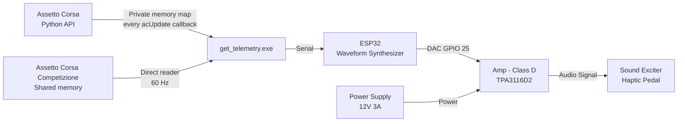

# DIY Haptic Feedback for Sim Racing Pedals

## Overview 

Sim racing pedals use load cells to provide accurate brake force, but they cannot replicate the tactile cues a driver feels in a real car - the pulsing of ABS engaging, the judder of locked wheel or the vibration from road texture. Without these cues, trail-braking near the limit becomes a guessing game based on the HUD or wheel feedbacks, which is far slower to react to than real-life sensation.

This project is a DIY guide to building a haptic feedback system for sim racing pedals, using a custom controller to simulate **ABS pulse** and **road effect** - on the brake pedal - restoring the tactiles information that a real car's brake pedals would provide.

## Existing solutions and why a custom approach

| Criteria | Eccentric motor (ERM) | Soundcard + bass shaker | This project (ESP32 + exciter) |
|---|---|---|---|
| **Cost** | Low | High | Low |
| **Response speed** | Slow (motor needs time to spin up/down) | Instant | Instant (Fastest) |
| **Vibration range** | Narrow, limited control | Wide, full control over frequency and amplitude | Acceptable, good enough for the target effects |
| **Safety** | Safe | Risk of damaging the laptop's soundcard or onboard audio circuit | Does not use the PC audio output |

**Eccentric motor (ERM):** This is the cheapest and simplest option. The motor spins to create vibration, but it takes time to speed up and slow down. This delay makes it feel slow and less precise, and the vibration only has one basic pattern, so it cannot represent different effects (ABS, road texture, etc.) very well.

**Soundcard + bass shaker:** This gives the best result. It reacts instantly and can produce almost any frequency and amplitude, so it can simulate many different effects clearly. But it usually needs a dedicated soundcard, which is expensive. It also carries a risk: if wired incorrectly or if there is a short circuit, it can send too much current back into the laptop's audio output or damage the onboard soundcard.

**This project:** Uses an ESP32 with its own DAC to generate the signal, and a separate class D amplifier to drive the exciter. Thus, it guarantees the latency within a predictable range (more consistent than soundcard-based system due to RTOS's property) and keeps the cost low (similar to the eccentric motor option). The vibration range is not as wide as a full soundcard setup, but it is enough to clearly represent the target effects (ABS, lock-up, road feel). Because the signal is generated on a separate microcontroller (not the PC's own soundcard), there is no risk of damaging the laptop's audio hardware.

## Supported features
- **ABS Feedback** -- When ABS intervenes, it pulses the brakes rapidly via a hydraulic modulator to prevent wheel lock-up. This causes the pedal to judder/vibrate.
- **Lock-up / Tire Slip** -- When the car locks up or the tires slip, kinetic friction between the tires and the road generates vibration that travels back through the suspension and chassis to the seat and pedals. To simplify this effect, this motor simulates a similar vibration pattern to what is felt at the seat, but at a weaker intensity.
- **Road Effect** - When the front tires hit a kerb, gravel, or debris, the impact vibration travels back through the pedals in a real car. This system derives that sensation from the normalized vertical speed of the front suspension.

## Supported games
- Assetto Corsa
- Assetto Corsa Competizione
- iRacing (Work in progress)

## System architecture

- **Signal path** - Assetto Corsa uses the bundled Python app to publish physical `SlipRatio` and suspension data through `haptic_telemetry_v1`. Assetto Corsa Competizione needs no Python app: `get_telemetry.exe` reads its extended shared-memory physics page directly. Both paths are normalized to the same five-field serial packet, and the ESP32 synthesizes waveforms at 16 kHz through its internal DAC (GPIO 25).

## Quick start

1. Assemble the system using the [hardware guide](docs/hardware.md).
2. Follow the [installation guide](docs/installation.md) to flash the ESP32 and install the host application.
3. Connect the ESP32 through USB, start a driving session, run `get_telemetry.exe`, and click **CONNECT**.

## Documentation
- [Hardware and wiring](docs/hardware.md)
- [Installation guide](docs/installation.md)
- [Design and control logic](docs/design.md)
- [Communication protocol](docs/protocol.md)
- [Build log and demos](docs/build_log.md)
- [LICENSE](LICENSE)

## Contribution

### My contributions
- Designed the overall PC-to-ESP32 telemetry pipeline.
- Developed the haptic response and mapping logic.
- Tuned and validated the haptic response.
- Designed ESP32 architecture :
1. separated time-critical control from communication and background tasks.
2. Used hardware timers for deterministic timing.
- Implemented most of the ESP32 firmware, including the telemetry receiver, waveform synthesis, effect logic, and hardware-timer-based control loop.
- Wrote the CLI prototype for get_telemetry app.
- Calculated and calibrated the power and output limit.
- Integrated and tested the system on sim-racing pedals.
- Wrote this project documentation.

### External and AI-assisted components
- Used generative AI extensively to implement the GUI application based on my specifications and system design.
- Used AI to assist with technical documentation, including formalizing mathematical expressions, generating Mermaid diagrams from my system designs, formatting information into tables, and cross-checking technical statements for consistency and accuracy.
- The ESP32 firmware was primarily written by me, with AI assistance used selectively for debugging and bug-fix patches.
- Some application-level components were implemented with substantial AI assistance. I understand their role, behavior, and integration within the system, but I did not independently design all of their internal implementation details.

