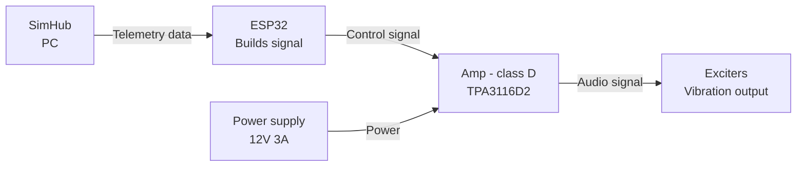

This project is a DIY guide to building a haptic feedback system for sim racing pedals, using a custom controller connected to SimHub to simulate **ABS pulse** and **road effect** — especially on the brake pedal. It addresses one of the most significant limitations of load-cell pedals: the lack of ABS and lock-up feedback during trail-braking.

# Existing solutions & why a custom approach

# System architecture

- **Signal path**  — SimHub reads game telemetry and exposes them as properties (e.g. ABS state, wheel slip). These values are sent to the ESP32 via serial. The ESP32 parses the incoming data and processes it through a mapping function, synthesizing a waveform (frequency and amplitude) for each effect. This signal is then output to the TPA3116D2 via the ESP32's internal DAC, which drives the sound exciters mounted on the pedal.

# Supported features :
- **ABS Feedback** -- When ABS intervenes, it pulses the brakes rapidly via a hydraulic modulator to prevent wheel lock-up. This causes the pedal to judder/vibrate.
- **Lock-up / Tire Slip** -- When the car locks up or the tires slip, kinetic friction between the tires and the road generates vibration that travels back through the suspension and chassis to the seat and pedals. To simplify this effect, this motor simulates a similar vibration pattern to what is felt at the seat, but at a weaker intensity.
- **Road Effect** — When the front tires hit a kerb, gravel, or debris, the impact vibration travels back through the pedals in a real car. This system reproduces that sensation using the game's surface/road-texture telemetry, mapped to vibration intensity on the pedal.

# Design rationale & control logic

# Hardware implementation
- ESP32 - DEVKIT-V1
- TPA3116D2
- DC 12V - 3A output
- Sound exciter from digital shopping mall

**Note:** The selected exciter has a rated frequency response of ~60Hz–20kHz (resonance frequency 60Hz ±20%), with SPL relatively stable between 20–150Hz and a dip around 300Hz–1kHz. Since target effects (e.g. ABS pulsing at 10–15Hz) fall below the exciter's effective operating range, a carrier-modulation approach was used instead of direct low-frequency playback (see Design Rationale).

# Firmware/software implementation

# Testing & calibration methodology

# Results/Demo

