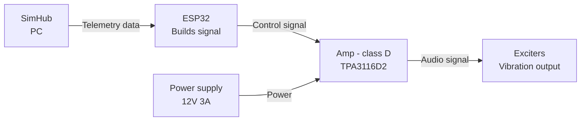
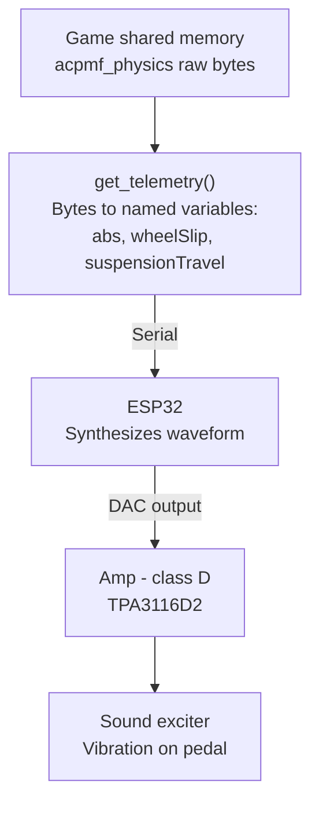

This project is a DIY guide to building a haptic feedback system for sim racing pedals, using a custom controller connected to SimHub to simulate **ABS pulse** and **road effect** — especially on the brake pedal. It addresses one of the most significant limitations of load-cell pedals: the lack of ABS and lock-up feedback during trail-braking.

# Existing solutions & why a custom approach

| Criteria | Eccentric motor (ERM) | Soundcard + bass shaker | This project (ESP32 + exciter) |
|---|---|---|---|
| **Cost** | Low | High | Low |
| **Response speed** | Slow (motor needs time to spin up/down) | Instant | Instant |
| **Vibration range** | Narrow, limited control | Wide, full control over frequency and amplitude | Acceptable, good enough for the target effects |
| **Safety** | Safe | Risk of damaging the laptop's soundcard or onboard audio circuit | Fully safe (isolated from the PC) |

**Eccentric motor (ERM):** This is the cheapest and simplest option. The motor spins to create vibration, but it takes time to speed up and slow down. This delay makes it feel slow and less precise, and the vibration only has one basic pattern, so it cannot represent different effects (ABS, road texture, etc.) very well.

**Soundcard + bass shaker:** This gives the best result. It reacts instantly and can produce almost any frequency and amplitude, so it can simulate many different effects clearly. But it usually needs a dedicated soundcard, which is expensive. It also carries a risk: if wired incorrectly or if there is a short circuit, it can send too much current back into the laptop's audio output or damage the onboard soundcard.

**This project:** Uses an ESP32 with its own DAC to generate the signal, and a separate class D amplifier to drive the exciter. This keeps the cost low (similar to the eccentric motor option), while still reacting instantly like the soundcard-based system. The vibration range is not as wide as a full soundcard setup, but it is enough to clearly represent the target effects (ABS, lock-up, road feel). Because the signal is generated on a separate microcontroller (not the PC's own soundcard), there is no risk of damaging the laptop's audio hardware.

# System architecture

- **Signal path**  — SimHub reads game telemetry and exposes them as properties (e.g. ABS state, wheel slip). These values are sent to the ESP32 via serial. The ESP32 parses the incoming data and processes it through a mapping function, synthesizing a waveform (frequency and amplitude) for each effect. This signal is then output to the TPA3116D2 via the ESP32's internal DAC, which drives the sound exciters mounted on the pedal.

# Supported features :
- **ABS Feedback** -- When ABS intervenes, it pulses the brakes rapidly via a hydraulic modulator to prevent wheel lock-up. This causes the pedal to judder/vibrate.
- **Lock-up / Tire Slip** -- When the car locks up or the tires slip, kinetic friction between the tires and the road generates vibration that travels back through the suspension and chassis to the seat and pedals. To simplify this effect, this motor simulates a similar vibration pattern to what is felt at the seat, but at a weaker intensity.
- **Road Effect** — When the front tires hit a kerb, gravel, or debris, the impact vibration travels back through the pedals in a real car. This system reproduces that sensation using the game's surface/road-texture telemetry, mapped to vibration intensity on the pedal.

# Design rationale & control logic

**Pipeline stages:**

1. **Game shared memory** — the game (AC) continuously writes raw physics data into a named memory-mapped block (`acpmf_physics`), updated every simulation step.
2. **`get_telemetry()`** — a function on the PC side that opens this shared memory block and casts the raw bytes into a struct (`SPageFilePhysics`), exposing named fields such as `abs`, `wheelSlip[4]`, and `suspensionTravel[4]`.

   **Note:** SimHub was initially considered for this step, since it already exposes many of these values in a standardized way across games. However, the free version limits the output rate to 10Hz, while the game itself updates physics data at up to 120Hz. Since a low, fixed update rate would make fast effects like ABS pulsing feel noticeably stepped, `get_telemetry()` was written to read the shared memory directly, bypassing this limitation and preserving the game's native update rate.
3. **ESP32** — receives the relevant values over serial, applies the effect logic (priority, weighting, carrier-modulation as described in Design Rationale), and continuously synthesizes a waveform sample-by-sample, output through its internal DAC.
4. **Class D amp (TPA3116D2)** — amplifies the low-power DAC signal enough to drive the exciter.
5. **Sound exciter** — converts the amplified electrical signal into physical vibration felt through the pedal.

### Telemetry Pre-processing: Signal Smoothing (LERP vs. EMA)

To prevent harsh, stepped vibrations caused by frame-to-frame telemetry updates, raw telemetry values are smoothed before generating waveforms:

- **LERP (Linear Interpolation):** Requires a strictly fixed arrival interval between data packets. Because Windows is not a real-time OS, packets can arrive with slight timing delays (e.g., 12 ms instead of 8.33 ms). This causes fixed-step LERP to finish too early or freeze, creating noticeable stutter.
- **EMA (Exponential Moving Average):** Calculates new values recursively using only the current reading and the previous smoothed state ($y[n] = y[n-1] + \alpha \cdot (x[n] - y[n-1])$). It runs independently of packet arrival timing, eliminating jitter. Furthermore, EMA creates a more natural feel because physical systems like brake fluid pressure and suspension damping naturally follow exponential decay curves (first-order dynamic response).

**Mathematical Formulation:**

$$y[n] = y[n-1] + 0.072 \cdot \big(x[n] - y[n-1]\big)$$

#### Step Response Over 42 Interrupt Cycles ($0 \rightarrow 100\%$ Step):

| Interrupt Step ($n$) | Elapsed Time ($t$) | Amplitude ($y[n]$) | Physical / Tactile Behavior |
|:---:|:---:|:---:|---|
| **$n = 0$** | $0.0\text{ ms}$ | **$0.00\%$** | New 120 Hz telemetry packet arrives via Serial |
| **$n = 1$** | $0.2\text{ ms}$ | **$7.20\%$** | Smooth motion starts, eliminating harsh 90° square steps |
| **$n = 5$** | $1.0\text{ ms}$ | **$31.26\%$** | Fast initial ramp-up within the first millisecond |
| **$n = 10$** | $2.0\text{ ms}$ | **$52.75\%$** | Passes 50% strength — initial haptic cue detected by foot |
| **$n = 14$** | $2.8\text{ ms}$ | **$64.90\%$** | Reaches standard time constant $1\tau$ ($63.2\%$ response) |
| **$n = 20$** | $4.0\text{ ms}$ | **$77.68\%$** | Reaches ~80% strength halfway through the frame |
| **$n = 30$** | $6.0\text{ ms}$ | **$89.45\%$** | Smooth asymptotic curve, preventing abrupt acceleration |
| **$n = 40$** | $8.0\text{ ms}$ | **$95.02\%$** | Standard convergence threshold ($3\tau \approx 95\%$) |
| **$n = 42$** | **$8.4\text{ ms}$** | **$95.70\%$** | Seamlessly completes transition as the next 120 Hz packet arrives |

After analyzing various $\alpha$ values, $\alpha = 0.072$ was chosen because it allows the step response to reach $\approx 95\%$ convergence within a single 120 Hz telemetry frame ($8.33\text{ ms}$), smoothly eliminating discrete steps without introducing perceptible latency.

### How all of the effects are calculated in this module:
1. **ABS:** In real life, ABS pulse is caused by the hydraulic modulator releasing and reapplying brake pressure rapidly 10–15 times per second (Bosch Automotive Handbook), so the frequency is set to 12 Hz, which is the sweet spot for ABS. Because sound exciters have poor low-frequency response at 12 Hz, I initially used Amplitude Modulation (AM)—modulating a 60 Hz carrier wave with a 12 Hz sine envelope—to maximize tactile feedback strength while preserving the realistic frequency. Since `absVal` is a boolean telemetry flag (0 or 1), driver brake pedal pressure (`brakeVal`) is used to scale the vibration amplitude dynamically:

$$y_{\text{carrier}}(t) = \sin(2\pi \cdot 60 \cdot t)$$
$$y_{\text{mod}}(t) = \sin(2\pi \cdot 12 \cdot t)$$

$$\Rightarrow y(t) = \left( \frac{1 + \sin(2\pi \cdot 12 \cdot t)}{2} \right) \cdot \sin(2\pi \cdot 60 \cdot t)$$

$$\text{DAC}(t) = 128 + (120 \cdot \text{brakeVal}) \cdot y(t)$$

**Note:** `brakeVal` is the normalized brake pedal pressure ($0.0 \le \text{brakeVal} \le 1.0$) from telemetry, `y(t)` is the modulated signal, and `DAC(t)` is the 8-bit value sent to the DAC.

**[18/8/2026 Update - Square-Wave Pulse Gating]:**

However, physical testing revealed that the continuous sine AM formula produced a soft, mushy vibration due to the mechanical limits of the sound exciter. To achieve crisp and punchy kicks, the continuous modulation was replaced with **square-wave pulse gating (12 Hz, ~65% Duty Cycle)**:

$$E_{\text{ABS}}(t) = \begin{cases} 
1 & \text{if } \left(t \bmod \frac{1}{12}\right) \le 3  \cdot \frac{1}{55} \quad (\approx 54.55\text{ ms ON}) \\
0 & \text{if } \left(t \bmod \frac{1}{12}\right) > 3 \cdot \frac{1}{55} \quad (\approx 28.79\text{ ms OFF})
\end{cases}$$

$$\Rightarrow y_{\text{ABS}}(t) = E_{\text{ABS}}(t) \cdot \sin(2\pi \cdot 55 \cdot t)$$

$$\text{DAC}_{\text{ABS}}(t) = 128 + (120 \cdot \text{brakeVal}) \cdot y_{\text{ABS}}(t) \quad (\text{active when } \text{absVal} = 1)$$

This ~65:35 duty cycle maintains the realistic 12 hydraulic cycles per second of an ABS system while delivering sharp, instantaneous tactile impacts to the pedal.

2. **Road Effect:** 
When the tires hit a bump or kerb, it imparts an impulse shock to the suspension. In real vehicles, this excites structural chassis and suspension resonances (~80–120 Hz, centered at 100 Hz, per Gillespie, 1992) transmitted through the firewall into the pedal box, with an intensity proportional to the vertical suspension displacement rate ($\Delta \text{Sus}$).

To simulate this tactile feel through the sound exciter, the amplitude is modulated by the frame-to-frame suspension velocity:

$$\Delta \text{Sus}(t) = \max\Big(|\text{SusL}(t) - \text{SusL}(t-1)|, \ |\text{SusR}(t) - \text{SusR}(t-1)|\Big)$$

$$A_{\text{road}}(t) = \min\left(60, \ \Delta \text{Sus}(t) \cdot \frac{60}{0.06}\right)$$

$$\text{DAC}_{\text{road}}(t) = A_{\text{road}}(t) \cdot \sin(2\pi \cdot 100 \cdot t)$$

3. **Lock-up / Tire Slip:** 
When the tires exceed the peak friction threshold, kinetic stick-slip friction and in-plane carcass torsional deformation generate continuous low-frequency vibrations (~45 Hz, per Pacejka, 2005). 

According to **Pacejka's $\mu\text{–Slip}$ Magic Formula curve** (*Tire and Vehicle Dynamics*), racing tires reach their peak braking friction ($\mu_{\max}$) at approximately $15\%\text{–}20\%$ longitudinal slip ratio ($\text{Slip} = 0.15\text{–}0.20$). Beyond $25\%\text{–}30\%$ slip, the tire exits the elastic grip zone and enters the unstable kinetic sliding region. 

To provide intuitive driver feedback without unnecessary foot fatigue during normal braking, a **threshold deadband of $\text{Slip} = 0.30$** is implemented:
- **$\text{Slip} < 0.30$ (Optimal Grip Zone):** The pedal remains completely smooth, confirming to the driver that braking is operating within the maximum traction envelope.
- **$0.30 \le \text{Slip} < 1.50$ (Progressive Scrub / Impending Lock-up):** The exciter vibrates at 45 Hz with an amplitude scaling linearly from $20 \rightarrow 50$, warning the driver to modulate brake pressure before a full lock-up occurs.
- **$\text{Slip} \ge 1.50$ (Full Lock-up):** Continuous maximum 45 Hz vibration (capped at 50) prompting an immediate brake release.

$$
\begin{aligned}
\text{Slip}_{\text{front}}(t) &= \max\Big(\text{slipL}(t), \ \text{slipR}(t)\Big) \\
\text{DAC}_{\text{slip}}(t)   &= 128 + A_{\text{slip}}(t) \cdot \sin(2\pi \cdot 45 \cdot t)
\end{aligned}
$$

Where the amplitude $A_{\text{slip}}(t)$ is defined by the piecewise mapping function:

$$
A_{\text{slip}}(t) = \begin{cases} 
0 & \text{if } \text{Slip}_{\text{front}} < 0.30 \quad (\text{Optimal Grip / Peak Friction}) \\
20 + 30 \cdot \left( \frac{\text{Slip}_{\text{front}} - 0.30}{1.50 - 0.30} \right) & \text{if } 0.30 \le \text{Slip}_{\text{front}} < 1.50 \quad (\text{Progressive Slip}) \\
50 & \text{if } \text{Slip}_{\text{front}} \ge 1.50 \quad (\text{Full Lock-up})
\end{cases}
$$

### Tire Slip Mapping & Perception Breakdown:

| Slip Value ($\text{Slip}_{\text{front}}$) | Tire Physical State (Pacejka Model) | Amplitude Formula ($A_{\text{slip}}$) | Output Amplitude ($A$) | Tactile Perception / Driver Feedback |
|---|---|---|---|---|
| **$0.00 \le \text{Slip} < 0.30$** | **Optimal Grip** *(Peak friction zone, $\mu \le \mu_{\max}$)* | $A = 0$ | **$0$ (Off)** | Pedal remains completely smooth; maximum braking efficiency. |
| **$0.30 \le \text{Slip} < 0.80$** | **Light Slip** *(Exceeding peak grip boundary)* | $A = 20 + 30 \cdot \left(\frac{\text{Slip} - 0.3}{1.2}\right)$ | **$20 \rightarrow 32$** | Smooth, subtle 45 Hz rumble indicating tire scrub. |
| **$0.80 \le \text{Slip} < 1.50$** | **Heavy Slip** *(Approaching full lock-up)* | $A = 20 + 30 \cdot \left(\frac{\text{Slip} - 0.3}{1.2}\right)$ | **$32 \rightarrow 50$** | Strong, distinct vibration warning the driver to modulate brake pressure. |
| **$\text{Slip} \ge 1.50$** | **Full Lock-up** *(Wheel rotation halted)* | $A = 50$ (Capped) | **$50$ (Max)** | Heavy continuous 45 Hz rumble prompting immediate brake release. |

### Signal Mixing & Headroom Management

When all 3 effects happen at the same time (e.g. braking hard (ABS) while hitting a bump (Road effect) while on a slippery surface (Tire slip)), the amplitudes of the 3 effects will add together :
    $$y_{\text{total}}(t) = y_{\text{ABS}}(t) + y_{\text{Slip}}(t) + y_{\text{Road}}(t)$$

This cause clipping (the DAC returned 255 in a period). To prevent the signal from clipping (distorting), a weighted priority mixing algorithm is applied :

$$\text{Output}(t) = 128 + \sum_{i} \Big( w_i \cdot y_i(t) \Big)$$
where $\sum w_i \le 1.0$, ensuring all combined waveforms stay within safe headroom limits while maintaining distinct feedback clarity.

# Hardware implementation
- ESP32 DevKit V1 — microcontroller that receives telemetry from SimHub and generates the control waveform
- TPA3116D2 — class D amplifier, drives the sound exciters
- Sound exciter — 4Ω 25W, resonance frequency ~60Hz — converts the amplified signal into physical vibration (see spec/frequency response note below)
- DC 12V 3A power supply — powers the amplifier
- 5.5mm x 2.1mm DC jack (female)

**Note:** The selected exciter has a rated frequency response of ~60Hz–20kHz (resonance frequency 60Hz ±20%), with SPL relatively stable between 20–150Hz and a dip around 300Hz–1kHz. Since target effects (e.g. ABS pulsing at 10–15Hz) fall below the exciter's effective operating range, a carrier-modulation approach was used instead of direct low-frequency playback (see Design Rationale).

# Firmware/software implementation

# Testing & calibration methodology

# Results/Demo

# Academic & Technical References

1. **Road Harshness & Structural Transmission (80–120 Hz):**
   - **Gillespie, Thomas D. (1992).** *Fundamentals of Vehicle Dynamics*. Society of Automotive Engineers (SAE International). Chapter 10: "Road Roughness & Ride NVH" (details the 80–120 Hz structural vibration transmission from suspension to the firewall and pedal box).
   - **Milliken, William F., & Milliken, Douglas L. (1995).** *Race Car Vehicle Dynamics*. SAE International. Chapter 17: "Ride and Handling NVH".

2. **Tire Stick-Slip, Friction Limits & Carcass Dynamics (30–50 Hz):**
   - **Pacejka, Hans B. (2005).** *Tire and Vehicle Dynamics* (2nd Edition). Butterworth-Heinemann / Elsevier. Chapter 1: "Tire Characteristics and Representations" (details the $\mu\text{–Slip}$ curve, peak braking friction threshold at 15–20% slip, unstable kinetic sliding zone $>30\%$, and in-plane carcass torsional modes).
   - **SAE Technical Paper 2008-01-0818:** *"In-Plane Tire Dynamics and Vibration Modes under Braking Torque"*.

3. **ABS Hydraulic Cycling Benchmark (10–15 Hz):**
   - **Bosch Automotive Handbook (10th Edition).** Robert Bosch GmbH. "Antilock Braking Systems (ABS) - Hydraulic Valve Modulation and Pressure Cycling".
   - **Industry Benchmarks:** SimHub ShakeIt standard tactile profiles and Simucube ActivePedal telemetry frequency mapping.
