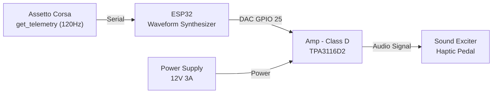
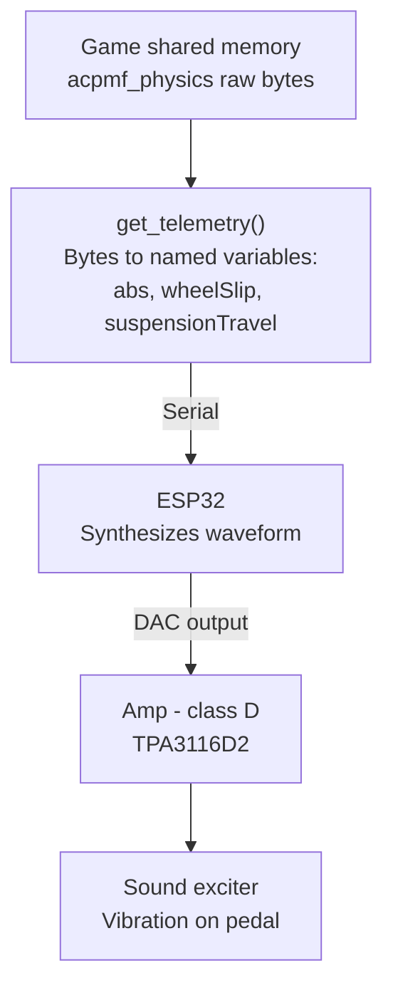

# Overview 

Sim racing pedals use load cells to provide accurate brake force, but they cannot replicate the tactile cues a driver feels in a real car - the pulsing of ABS engaging, the judder of locked wheel or the vibration from road texture. Without these cues, trail-braking near the limit becomes a guessing game based on the HUD or wheel feedbacks, which is far slower to react to than real-life sensation.

This project is a DIY guide to building a haptic feedback system for sim racing pedals, using a custom controller to simulate **ABS pulse** and **road effect** - on the brake pedal - restoring the tactiles information that a real car's brake pedals would provide.

# Existing solutions & why a custom approach

| Criteria | Eccentric motor (ERM) | Soundcard + bass shaker | This project (ESP32 + exciter) |
|---|---|---|---|
| **Cost** | Low | High | Low |
| **Response speed** | Slow (motor needs time to spin up/down) | Instant | Instant (Fastest) |
| **Vibration range** | Narrow, limited control | Wide, full control over frequency and amplitude | Acceptable, good enough for the target effects |
| **Safety** | Safe | Risk of damaging the laptop's soundcard or onboard audio circuit | Fully safe (isolated from the PC) |

**Eccentric motor (ERM):** This is the cheapest and simplest option. The motor spins to create vibration, but it takes time to speed up and slow down. This delay makes it feel slow and less precise, and the vibration only has one basic pattern, so it cannot represent different effects (ABS, road texture, etc.) very well.

**Soundcard + bass shaker:** This gives the best result. It reacts instantly and can produce almost any frequency and amplitude, so it can simulate many different effects clearly. But it usually needs a dedicated soundcard, which is expensive. It also carries a risk: if wired incorrectly or if there is a short circuit, it can send too much current back into the laptop's audio output or damage the onboard soundcard.

**This project:** Uses an ESP32 with its own DAC to generate the signal, and a separate class D amplifier to drive the exciter. This keeps the cost low (similar to the eccentric motor option), while still reacting instantly like the soundcard-based system. The vibration range is not as wide as a full soundcard setup, but it is enough to clearly represent the target effects (ABS, lock-up, road feel). Because the signal is generated on a separate microcontroller (not the PC's own soundcard), there is no risk of damaging the laptop's audio hardware.

# System architecture

- **Signal path**  - Game physics telemetry is read directly from shared memory at 120 Hz (`get_telemetry()`) and transmitted to the ESP32 over Serial. The ESP32 parses the telemetry, applies the effect mapping logic, and continuously synthesizes analog waveforms through its internal DAC (GPIO 25). The signal is amplified by the TPA3116D2 Class D amplifier to drive the sound exciter mounted on the pedal.

# Supported features :
- **ABS Feedback** -- When ABS intervenes, it pulses the brakes rapidly via a hydraulic modulator to prevent wheel lock-up. This causes the pedal to judder/vibrate.
- **Lock-up / Tire Slip** -- When the car locks up or the tires slip, kinetic friction between the tires and the road generates vibration that travels back through the suspension and chassis to the seat and pedals. To simplify this effect, this motor simulates a similar vibration pattern to what is felt at the seat, but at a weaker intensity.
- **Road Effect** - When the front tires hit a kerb, gravel, or debris, the impact vibration travels back through the pedals in a real car. This system reproduces that sensation using the game's surface/road-texture telemetry, mapped to vibration intensity on the pedal.

# Design rationale & control logic

**Pipeline stages:**

1. **Game shared memory** - the game (AC) continuously writes raw physics data into a named memory-mapped block (`acpmf_physics`), updated every simulation step.
2. **`get_telemetry()`** - a function on the PC side that opens this shared memory block and casts the raw bytes into a struct (`SPageFilePhysics`), exposing named fields such as `abs`, `wheelSlip[4]`, and `suspensionTravel[4]`.

   **Note:** SimHub was initially considered for this step, since it already exposes many of these values in a standardized way across games. However, the free version limits the output rate to 10Hz, while the game itself updates physics data at up to 120Hz. Since a low, fixed update rate would make fast effects like ABS pulsing feel noticeably stepped, `get_telemetry()` was written to read the shared memory directly, bypassing this limitation and preserving the game's native update rate.
3. **ESP32** - receives the relevant values over serial, applies the effect logic (priority, weighting, carrier-modulation as described in Design Rationale), and continuously synthesizes a waveform sample-by-sample, output through its internal DAC.
4. **Class D amp (TPA3116D2)** - amplifies the low-power DAC signal enough to drive the exciter.
5. **Sound exciter** - converts the amplified electrical signal into physical vibration felt through the pedal.

### Telemetry Pre-processing: Signal Smoothing (LERP vs. EMA)

To prevent harsh, stepped vibrations caused by frame-to-frame telemetry updates, raw telemetry values are smoothed before generating waveforms:

- **LERP (Linear Interpolation):** Requires a strictly fixed arrival interval between data packets. Because Windows is not a real-time OS, packets can arrive with slight timing delays (e.g., 12 ms instead of 8.33 ms). This causes fixed-step LERP to finish too early or freeze, creating noticeable stutter.
- **EMA (Exponential Moving Average):** Calculates new values recursively using only the current reading and the previous smoothed state. It runs independently of packet arrival timing, eliminating jitter. Furthermore, EMA creates a more natural feel because physical systems like brake fluid pressure and suspension damping naturally follow exponential decay curves (first-order dynamic response).

**Mathematical Formulation:**

The discrete first-order Exponential Moving Average (EMA) filter is defined as:

$$y[n] = y[n-1] + \alpha \cdot \big(x[n] - y[n-1]\big)$$

**Implementation in this project (Weighted ABS Intensity):**

$$\text{Target}_{\text{ABS}}[n] = \begin{cases} 
w_{\text{ABS}} \cdot \text{brakeVal}[n] & \text{if } \text{absVal} = 1 \\
0 & \text{if } \text{absVal} = 0 
\end{cases}$$

$$y[n] = y[n-1] + 0.01131 \cdot \Big(\text{Target}[n] - y[n-1]\Big)$$

Where:
- $y[n]$: Smoothed amplitude at interrupt step $n$.
- $y[n-1]$: Smoothed state from the preceding $62.5\ \mu\text{s}$ timer interrupt cycle.
- $\text{Target}[n]$: Target demand from PC.
- $\alpha = 0.01131$: Smoothing factor calibrated for $95\%$ convergence within one 60 Hz telemetry frame.

#### Step Response Over 266 Interrupt Cycles ($0 \rightarrow 100\%$ Step):

| Interrupt Step ($n$) | Elapsed Time ($t$) | Amplitude ($y[n]$) | Physical / Tactile Behavior |
| --- | --- | --- | --- |
| **$n = 0$** | $0.00\text{ ms}$ | **$0.00\%$** | New 60 Hz telemetry packet arrives via Serial. |
| **$n = 1$** | $0.06\text{ ms}$ | **$1.13\%$** | First tiny step ($62.5\ \mu\text{s}$), removing harsh 90° square edges. |
| **$n = 16$** | $1.00\text{ ms}$ | **$16.63\%$** | Smooth vibration ramp-up within the first 1 ms. |
| **$n = 64$** | $4.00\text{ ms}$ | **$51.70\%$** | Passes 50% amplitude - driver foot senses the effect. |
| **$n = 88$** | $5.50\text{ ms}$ | **$63.22\%$** | Reaches standard time constant $1\tau$ ($63.2\%$). |
| **$n = 128$** | $8.00\text{ ms}$ | **$76.62\%$** | Reaches nearly 80% strength halfway through the frame. |
| **$n = 192$** | $12.00\text{ ms}$ | **$88.72\%$** | Smooth asymptotic curve, preventing abrupt jerks. |
| **$n = 256$** | $16.00\text{ ms}$ | **$94.55\%$** | Reaches standard convergence threshold (~95.0%). |
| **$n = 266$** | **$16.63\text{ ms}$** | **$95.16\%$** | Seamlessly completes 1 frame ($16.67\text{ ms}$) as the next packet arrives. |

After analyzing various $\alpha$ values, $\alpha = 0.01131$ was chosen because it allows the step response to reach $\approx 95\%$ convergence within a single 60 Hz telemetry frame ($16.67\text{ ms}$), smoothly eliminating discrete steps without introducing perceptible latency.

**[21/8/2026 Update - Fixing floating point]**
- When using EMA smoothing with a very small $\Delta$ (where $\Delta = |\text{Target}[n] - y[n-1]|$), it may cause ESP32 fatal panics, so the $\Delta$ is limited to $\Delta \ge 10^{-4}$.

### How all of the effects are calculated in this module:
1. **ABS:** In real life, ABS pulse is caused by the hydraulic modulator releasing and reapplying brake pressure rapidly 10–15 times per second (Bosch Automotive Handbook), so the frequency is set to 12 Hz, which is the sweet spot for ABS. Because sound exciters have poor low-frequency response at 12 Hz, Amplitude Modulation (AM) is used - modulating a 60 Hz carrier wave with a 12 Hz sine envelope to maximize tactile feedback strength while preserving the realistic frequency. Since `absVal` is a boolean telemetry flag (0 or 1), driver brake pedal pressure (`brakeVal`) is used to scale the vibration amplitude dynamically:

~~$$y_{\text{carrier}}(t) = \sin(2\pi \cdot 60 \cdot t)$$~~
~~$$y_{\text{mod}}(t) = \sin(2\pi \cdot 12 \cdot t)$$~~

~~$$\Rightarrow y(t) = \left( \frac{1 + \sin(2\pi \cdot 12 \cdot t)}{2} \right) \cdot \sin(2\pi \cdot 60 \cdot t)$$~~

~~$$\text{DAC}(t) = 128 + (105 \cdot \text{brakeVal}) \cdot y(t)$$~~

~~**Note:** `brakeVal` is the normalized brake pedal pressure ($0.0 \le \text{brakeVal} \le 1.0$) from telemetry, `y(t)` is the modulated signal, and `DAC(t)` is the 8-bit value sent to the DAC.~~

*(Deprecated - see the 18/8/2026 Update below for the revised approach)*

**[18/8/2026 Update - Square-Wave Pulse Gating]:**

However, physical testing revealed that the continuous sine AM formula produced a soft, mushy vibration due to the mechanical limits of the sound exciter. To achieve crisp and punchy kicks, the continuous modulation was replaced with **square-wave pulse gating (12 Hz, ~65% Duty Cycle)**:

$$E_{\text{ABS}}(t) = \begin{cases} 
1 & \text{if } \left(t \bmod \frac{1}{12}\right) \le 3  \cdot \frac{1}{60} \quad (\approx 50\text{ ms ON}) \\
0 & \text{if } \left(t \bmod \frac{1}{12}\right) > 3 \cdot \frac{1}{60} \quad (\approx 33.33\text{ ms OFF})
\end{cases}$$

$$\Rightarrow y_{\text{ABS}}(t) = E_{\text{ABS}}(t) \cdot \sin(2\pi \cdot 60 \cdot t)$$

$$\text{DAC}_{\text{ABS}}(t) = 128 + (105 \cdot \text{brakeVal}) \cdot y_{\text{ABS}}(t) \quad (\text{active when } \text{absVal} = 1)$$

This ~60:40 duty cycle (50 ms ON / 33.33 ms OFF) maintains the realistic 12 hydraulic cycles per second of an ABS system while delivering sharp, instantaneous tactile impacts to the pedal.

**[20/8/2026 Update - ABS data]:**
There is a problem, the pf->abs in the shared memory is the stage of ABS that the current car used, not the abs engage flag. So the ABS is actived by a new formula :

$$\text{absVal} = (\text{brakeVal} > 0.05 \ \land \ \max(\text{slipL}, \text{slipR}) > 0.8 \ \land \ \text{pf->abs} > 0)$$

2. **Road Effect:** 
When the tires hit a big bump or kerb or, it imparts an impulse shock to the suspension. Based on previous sim racing hardware builders' experience, 75Hz is the chosen frequency with an intensity proportional to the vertical suspension displacement rate ($\Delta \text{Sus}$). However, the suspensions act like a Low-pass filter, so maybe only big kerb or bumps is clearly felt in the pedal.

To simulate this tactile feel through the sound exciter, the amplitude is modulated by the frame-to-frame suspension velocity:

$$\Delta \text{Sus}(t) = \max\Big(|\text{SusL}(t) - \text{SusL}(t-1)|, \ |\text{SusR}(t) - \text{SusR}(t-1)|\Big)$$

$$A_{\text{road}}(t) = \min\left(30, \ \Delta \text{Sus}(t) \cdot \frac{30}{0.015}\right)$$

$$\text{DAC}_{\text{road}}(t) = A_{\text{road}}(t) \cdot \sin(2\pi \cdot 100 \cdot t)$$

**Note :**  

* $0.015$$m$ is the maximum displacement of the suspension system in this build in 1 frame.
* The frequency run continiously from the start. 
* EMA smoothing uses an asymmetric decay ($\alpha = 0.0038$) when $\Delta\text{Sus}$ decreases to eliminate abrupt popping noises while preserving a punchy and crisp kerb impact (~95ms settling time).

3. **Lock-up / Tire Slip:** 
When the tires exceed the peak friction threshold, kinetic stick-slip friction and in-plane carcass torsional deformation generate continuous low-frequency vibrations. 

According to **Pacejka's $\mu\text{–Slip}$ Magic Formula curve** (*Tire and Vehicle Dynamics*), racing tires reach their peak braking friction ($\mu_{\max}$) at approximately $15\%\text{-}20\%$ longitudinal slip ratio ($\text{Slip} = 0.15\text{-}0.20$). Beyond $25\%\text{-}30\%$ slip, the tire exits the elastic grip zone and enters the unstable kinetic sliding region. 

To provide intuitive driver feedback without unnecessary foot fatigue during normal braking, a **threshold deadband of $\text{Slip} = 0.30$** is implemented:
- **$\text{Slip} < 0.30$ (Optimal Grip Zone):** The pedal remains completely smooth, confirming to the driver that braking is operating within the maximum traction envelope.
- **$0.30 \le \text{Slip} < 1.50$ (Progressive Scrub / Impending Lock-up):** The exciter vibrates at 45 Hz with an amplitude scaling linearly from $10 \rightarrow 37$, warning the driver to modulate brake pressure before a full lock-up occurs.
- **$\text{Slip} \ge 1.50$ (Full Lock-up):** Continuous maximum 45 Hz vibration (capped at 37) prompting an immediate brake release.

$$
\begin{aligned}
\text{Slip}_{\text{front}}(t) &= \max\Big(\text{slipL}(t), \ \text{slipR}(t)\Big) \\
\text{DAC}_{\text{slip}}(t)   &= 128 + A_{\text{slip}}(t) \cdot \sin(2\pi \cdot 45 \cdot t)
\end{aligned}
$$

Where the amplitude $A_{\text{slip}}(t)$ is defined by the piecewise mapping function:

$$
A_{\text{slip}}(t) = \begin{cases} 
0 & \text{if } \text{Slip}_{\text{front}} < 0.30 \quad (\text{Optimal Grip / Peak Friction}) \\
10 + 27 \cdot \left( \frac{\text{Slip}_{\text{front}} - 0.30}{1.50 - 0.30} \right) & \text{if } 0.30 \le \text{Slip}_{\text{front}} < 1.50 \quad (\text{Progressive Slip}) \\
37 & \text{if } \text{Slip}_{\text{front}} \ge 1.50 \quad (\text{Full Lock-up})
\end{cases}
$$

**Note :** 50Hz is the chosen frequency based on previous sim racing DIY builders' experience and physical testing.

### Tire Slip Mapping & Perception Breakdown:

| Slip Value ($\text{Slip}_{\text{front}}$) | Tire Physical State (Pacejka Model) | Amplitude Formula ($A_{\text{slip}}$) | Output Amplitude ($A$) | Tactile Perception / Driver Feedback |
|---|---|---|---|---|
| **$0.00 \le \text{Slip} < 0.30$** | **Optimal Grip** (Peak friction zone, $\mu \le \mu_{\text{max}}$) | $A = 0$ | **$0$ (Off)** | Pedal remains completely smooth; maximum braking efficiency. |
| **$0.30 \le \text{Slip} < 0.80$** | **Light Slip** (Exceeding peak grip boundary) | $A = 10 + 27 \cdot \left(\frac{\text{Slip} - 0.3}{1.2}\right)$ | **$10 \rightarrow 21$** | Smooth, subtle 50 Hz rumble indicating tire scrub. |
| **$0.80 \le \text{Slip} < 1.50$** | **Heavy Slip** (Approaching full lock-up) | $A = 10 + 27 \cdot \left(\frac{\text{Slip} - 0.3}{1.2}\right)$ | **$21 \rightarrow 37$** | Strong, distinct vibration warning the driver to modulate brake pressure. |
| **$\text{Slip} \ge 1.50$** | **Full Lock-up** (Wheel rotation halted) | $A = 37$ (Capped) | **$37$ (Max)** | Heavy continuous 50 Hz rumble prompting immediate brake release. |

### Signal Mixing & Headroom Management

When all 3 effects happen at the same time (e.g. braking hard (ABS) while hitting a bump (Road effect) while on a slippery surface (Tire slip)), the amplitudes of the 3 effects will add together :
    $$y_{\text{total}}(t) = y_{\text{ABS}}(t) + y_{\text{Slip}}(t) + y_{\text{Road}}(t)$$

So, to prevent the signal from clipping and disorting, a weighted system using a LUT (look-up table) is applied :

| State (Bit 2,1,0) | Active Effects | ABS Weight | Road Weight | Slip Weight | Total Weight |
| :---: | :--- | :---: | :---: | :---: | :---: |
| `000` | None | `0.00` | `0.00` | `0.00` | `0.00` |
| `001` | ABS only | `1.00 * H_M` | `0.00` | `0.00` | `1.00 * H_M` |
| `010` | Road only | `0.00` | `1.00 * H_M` | `0.00` | `1.00 * H_M` |
| `011` | ABS + Road | `0.75 * H_M` | `0.25 * H_M` | `0.00` | `1.00 * H_M` |
| `100` | Slip only | `0.00` | `0.00` | `1.00 * H_M` | `1.00 * H_M` |
| `101` | ABS + Slip | `0.85 * H_M` | `0.00` | `0.15 * H_M` | `1.00 * H_M` |
| `110` | Road + Slip | `0.00` | `0.35 * H_M` | `0.65 * H_M` | `1.00 * H_M` |
| `111` | ABS + Road + Slip | `0.60 * H_M` | `0.25 * H_M` | `0.15 * H_M` | `1.00 * H_M` |

Where the Headroom Multiplier ($H_M$) is calculated as:
$$H_M = \frac{\text{Max DAC Amplitude}}{\text{Max ABS} + \text{Max Road} + \text{Max Slip}} = \frac{127}{120 + 70 + 85} \approx 0.4618$$

# Hardware implementation
- ESP32 DevKit V1 - microcontroller that receives telemetry from the PC through get_telemetry() and generates the control waveform
- TPA3116D2 - class D amplifier, drives the sound exciters
- Sound exciter - 4Ω 25W, resonance frequency ~60Hz - converts the amplified signal into physical vibration (see spec/frequency response note below)
- DC 12V 3A power supply - powers the amplifier
- 5.5mm x 2.1mm DC jack (female)

**Note:** The selected exciter has a rated frequency response of ~60Hz–20kHz (resonance frequency 60Hz ±20%), with SPL relatively stable between 20–150Hz and a dip around 300Hz–1kHz. Since target effects (e.g. ABS pulsing at 10–15Hz) fall below the exciter's effective operating range, a carrier-modulation approach was used instead of direct low-frequency playback (see Design Rationale).

# Firmware/software implementation

### Software :

- CLI version : read_and_send.exe
- GUI version : get_telemetry.exe

- C++ was used for best performance and reduce packet loss or late data transfer when sending the game telemetry data to ESP32

### Firmware :

- Dual core computing (parallel computing): 
1. Using Core 0 for reading telemetry data from the game and assigning the global variables.
2. Using Core 1 for generating waveform (ABS, Slip, Road effect) (EMA smoothing, etc.) and sending it to DAC using hardware timer and interrupt with sampling rate of 16000Hz.

- Status indicator using LED when telemetry packets are actively received and zero loss.

- Performance and resources :
1. Core 0 utilizes less than 0.2% and Core 1 utilizes less than 0.75% of CPU capacity, reducing latency and performance overhead to nearly 0%.
2. Memory usage is minimal, with only a few kilobytes of RAM used for storing telemetry data and global variables.
3. Although sinf(x) is O(1) time complexity, using it still costs a lot of CPU resources and time to solve, so a LUT (Look-up table) is used to reduce the CPU usage and calculation time. Also, when using a high sample rate such as 16000Hz, using the sinf(x) function may cause floating point errors and return incorrect data. Therefore, using LUT is more stable and efficient for generating waveforms. LUT formula : the circle is divided into 1024 parts, so the angle will be : $\theta = 2\pi \cdot \frac{i}{1024}$, so $\sin \theta = \sin(2\pi \cdot \frac{i}{1024})$ where $i$ is the index of the LUT. And a sine wave step after a single sampling is calculated by $\frac{\text{frequency} \times 1024}{\text{sample rate}}$. For example, ABS at 60Hz with 16000Hz sample rate : $\frac{60 \times 1024}{16000} = 3.84$.

4. Because the hardware timer interrupt runs from internal RAM (`IRAM_ATTR`), using `<cmath>` library functions (like `fminf`, `fabsf`, `fmaxf`, etc.) can cause the ESP32 to crash. These functions are stored in external SPI Flash, and accessing them during an interrupt when the flash cache is disabled will result in a fatal panic. Therefore, basic conditional statements are used instead.

### How it works :

```mermaid
flowchart TD
    subgraph AC ["1. Assetto Corsa (Game Engine)"]
        GameLoop["Physics Engine (acs.exe)"]
        SharedMem[("Windows Shared Memory\n'Local\\acpmf_physics'")]
        GameLoop -->|"Writes physics data @ 120 Hz"| SharedMem
    end

    subgraph Host ["2. C++ Software Bridge (get_telemetry / read_and_send.cpp)"]
        MapFile["Memory Mapping\n(MapViewOfFile)"]
        StructMap["Cast raw buffer to struct\n(SPageFilePhysics* via structed_file.h)"]
        
        subgraph ExtractData ["Data Extraction (6 Channels)"]
            Val1["pf->abs (ABS Active Flag)"]
            Val2["pf->brake (Brake Pedal Pressure: 0.0 - 1.0)"]
            Val3["pf->wheelSlip[0, 1] (FL & FR Longitudinal Slip)"]
            Val4["pf->suspensionTravel[0, 1] (FL & FR Suspension Travel)"]
        end

        FormatPacket["Format CSV String Buffer\n'abs,brake,slipL,slipR,susL,susR\\n'"]
        SerialWrite["Win32 Serial Interface (WriteFile)\n115200 Baud / 8-N-1 @ 120 Hz"]

        SharedMem -->|"Read buffer"| MapFile
        MapFile -->|"Structured deserialization"| StructMap
        StructMap --> ExtractData
        ExtractData --> FormatPacket
        FormatPacket --> SerialWrite
    end

    subgraph ESP ["3. ESP32 Microcontroller (Firmware)"]
        UARTCore0["Core 0: UART Receiver Task\nsscanf CSV payload into floats"]
        EMA["EMA Step-Response Filtering\n(alpha = 0.072 / 42 ISR ticks)"]
        TimerCore1["Core 1: 5000 Hz Hardware Timer ISR\nWaveform Synthesis (ABS 60Hz + Road 100Hz + Slip 50Hz)"]
        DAC["8-Bit Hardware DAC (GPIO 25)\nDirect Register: RTC_IO_PAD_DAC1_REG"]

        SerialWrite -->|"USB-UART Virtual COM Port"| UARTCore0
        UARTCore0 --> EMA
        EMA --> TimerCore1
        TimerCore1 --> DAC
    end

    classDef game fill:#1a237e,stroke:#3949ab,stroke-width:2px,color:#ffffff;
    classDef host fill:#004d40,stroke:#00897b,stroke-width:2px,color:#ffffff;
    classDef esp fill:#bf360c,stroke:#f4511e,stroke-width:2px,color:#ffffff;

    class GameLoop,SharedMem game;
    class MapFile,StructMap,Val1,Val2,Val3,Val4,FormatPacket,SerialWrite host;
    class UARTCore0,EMA,TimerCore1,DAC esp;
```

# Results/Demo

# Academic & Technical References

1. **ABS Hydraulic Cycling Benchmark (10–15 Hz):**
   - **Bosch Automotive Handbook (10th Edition).** Robert Bosch GmbH. "Antilock Braking Systems (ABS) - Hydraulic Valve Modulation and Pressure Cycling".
