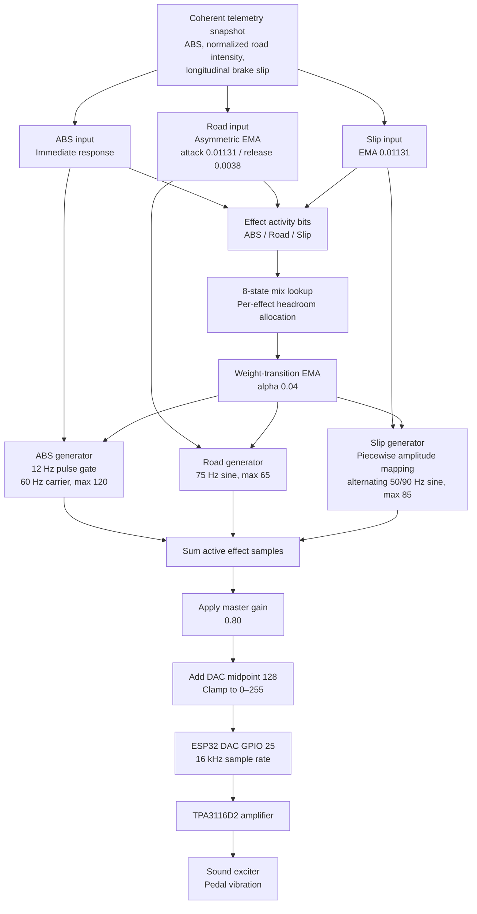

# Design rationale and control logic




**Pipeline stages:**

1. **Coherent telemetry snapshot** - the Core 1 waveform engine reads one consistent set of ABS, normalized road-intensity, and longitudinal brake-slip values published by the Core 0 serial task.
2. **Per-effect pre-processing** - ABS is kept immediate, road intensity uses asymmetric EMA smoothing, and brake slip uses standard EMA smoothing.
3. **Activity detection and headroom allocation** - three activity bits select one of eight mix-table rows. The selected ABS, road, and slip weights transition through a separate EMA to avoid sudden gain changes.
4. **Waveform synthesis** - the firmware generates the gated 60 Hz ABS carrier, the 75 Hz road sine, and the alternating 50/90 Hz brake-slip sine independently.
5. **Output conditioning** - active samples are added, multiplied by the `0.80` master gain, centered at DAC value `128`, and clamped to the 8-bit range.
6. **Physical output** - GPIO 25 sends the 16 kHz DAC signal to the TPA3116D2 amplifier, which drives the pedal-mounted sound exciter.


## Telemetry pre-processing: signal smoothing (LERP vs. EMA)

To prevent harsh, stepped vibrations caused by frame-to-frame telemetry updates, raw telemetry values are smoothed before generating waveforms:

- **LERP (Linear Interpolation):** Requires a strictly fixed arrival interval between data packets. Because Windows is not a real-time OS, packets can arrive with slight timing delays (e.g., 12 ms instead of 8.33 ms). This causes fixed-step LERP to finish too early or freeze, creating noticeable stutter.
- **EMA (Exponential Moving Average):** Calculates new values recursively using only the current reading and the previous smoothed state. It runs independently of packet arrival timing, eliminating jitter. Furthermore, EMA creates a more natural feel because physical systems like brake fluid pressure and suspension damping naturally follow exponential decay curves (first-order dynamic response).

**Mathematical Formulation:**

The discrete first-order Exponential Moving Average (EMA) filter is defined as:

$$y[n] = y[n-1] + \alpha \cdot \big(x[n] - y[n-1]\big)$$

**Implementation in this project (Road-effect intensity):**

The PC sends one normalized road-intensity value per front wheel. The ESP32
uses the stronger input as the target:

$$x_{\text{road}}[n] = \max\Big(R_{FL}[n], R_{FR}[n]\Big)$$

The road effect uses a faster attack and a slower release:

$$
\alpha[n] = \begin{cases}
0.01131 & \text{if } x_{\text{road}}[n] > y[n-1] \\
0.0038 & \text{otherwise}
\end{cases}
$$

$$y[n] = y[n-1] + \alpha[n] \cdot \Big(x_{\text{road}}[n] - y[n-1]\Big)$$

The smoothed value is then converted to the road waveform amplitude:

$$A_{\text{road}}[n] = 65y[n]$$

Where:
- $y[n]$: Smoothed, normalized road intensity at interrupt step $n$.
- $y[n-1]$: Smoothed state from the preceding $62.5\ \mu\text{s}$ timer interrupt cycle.
- $R_{FL}[n]$ and $R_{FR}[n]$: Normalized front-wheel road intensities received from the PC.
- $\alpha_{\text{attack}} = 0.01131$: Reaches approximately $95\%$ within one 60 Hz telemetry frame.
- $\alpha_{\text{release}} = 0.0038$: Lets the effect decay more gradually after an impact.


### Road-intensity attack over 266 interrupt cycles ($0 \rightarrow 100\%$ step)


| Interrupt Step ($n$) | Elapsed Time ($t$) | Smoothed road intensity ($y[n]$) | Physical / Tactile Behavior |
| --- | --- | --- | --- |
| **$n = 0$** | $0.00\text{ ms}$ | **$0.00\%$** | A new full-strength road-impact target arrives via Serial. |
| **$n = 1$** | $0.06\text{ ms}$ | **$1.13\%$** | The first small step avoids an abrupt exciter kick. |
| **$n = 16$** | $1.00\text{ ms}$ | **$16.63\%$** | Smooth vibration ramp-up within the first 1 ms. |
| **$n = 64$** | $4.00\text{ ms}$ | **$51.70\%$** | Passes 50% amplitude - driver foot senses the effect. |
| **$n = 88$** | $5.50\text{ ms}$ | **$63.22\%$** | Reaches standard time constant $1\tau$ ($63.2\%$). |
| **$n = 128$** | $8.00\text{ ms}$ | **$76.62\%$** | Reaches nearly 80% strength halfway through the frame. |
| **$n = 192$** | $12.00\text{ ms}$ | **$88.72\%$** | Smooth asymptotic curve, preventing abrupt jerks. |
| **$n = 256$** | $16.00\text{ ms}$ | **$94.55\%$** | Reaches standard convergence threshold (~95.0%). |
| **$n = 266$** | **$16.63\text{ ms}$** | **$95.16\%$** | Seamlessly completes 1 frame ($16.67\text{ ms}$) as the next packet arrives. |


For the road-effect attack, $\alpha = 0.01131$ reaches $\approx 95\%$ convergence within a single 60 Hz telemetry frame ($16.67\text{ ms}$), smoothing discrete telemetry steps while keeping kerb impacts responsive. The smaller release coefficient, $\alpha = 0.0038$, produces a slower decay so the vibration does not stop abruptly.

**[21/8/2026 Update - Fixing floating point]**
- When the remaining EMA difference is very small ($\Delta = |\text{Target}[n] - y[n-1]| < 10^{-4}$), the implementation returns the target value directly. This ends insignificant residual updates and prevents the filter from spending additional interrupt cycles converging on an effectively identical value.

## Effect calculations
1. **ABS:** In real life, ABS pulse is caused by the hydraulic modulator releasing and reapplying brake pressure rapidly 10–15 times per second (Bosch Automotive Handbook), so the pulse rate is set to 12 Hz.

**Host-side ABS detection:**

For Assetto Corsa, the host application does not treat the shared-memory `abs` field as a moment-by-moment activation flag. It derives ABS onset from the Python API's front longitudinal slip ratios; the shared-memory field only confirms availability and optionally supplies a plausible `0.03..0.30` threshold. For Assetto Corsa Competizione, the host uses the native shared-memory `abs` intervention signal directly, so no inferred ABS threshold is required. ACC's later `absInAction` compatibility field is not used because the game does not populate it. For AC, the host-side activation condition is:

$$\text{absVal} = (\text{brake} > 0.05 \ \land \ \text{speed} > 3\text{ km/h} \ \land \ \text{ABS enabled} \ \land \ \max(|\kappa_{FL}|, |\kappa_{FR}|) \ge \kappa_{ABS})$$

Once active, the host keeps `absVal = 1` until the brake/speed/availability gate fails or the maximum front slip falls below $0.70\kappa_{ABS}$. This hysteresis prevents rapid on/off toggling near the threshold.

`absVal` is calculated by the host application and transmitted as the first field of the five-field serial packet. The ESP32 firmware does not detect ABS; it only uses this boolean value (`0` or `1`) to disable or enable the ABS waveform.

**ESP32 waveform generation:**

Because sound exciters have poor low-frequency response at 12 Hz, the firmware pulse-gates a 60 Hz carrier at 12 Hz to preserve the pulse rhythm while producing stronger tactile output. A square-wave gate with an approximately 60% duty cycle produces crisp, distinct kicks:

$$E_{\text{ABS}}(t) = \begin{cases} 
1 & \text{if } \left(t \bmod \frac{1}{12}\right) \le 3  \cdot \frac{1}{60} \quad (\approx 50\text{ ms ON}) \\
0 & \text{if } \left(t \bmod \frac{1}{12}\right) > 3 \cdot \frac{1}{60} \quad (\approx 33.33\text{ ms OFF})
\end{cases}$$

$$\Rightarrow y_{\text{ABS}}(t) = E_{\text{ABS}}(t) \cdot \sin(2\pi \cdot 60 \cdot t)$$

$$x_{\text{ABS}}(t) = (120 \cdot \text{absVal}) \cdot y_{\text{ABS}}(t) \quad (\text{active when } \text{absVal} = 1)$$

This ~60:40 duty cycle (50 ms ON / 33.33 ms OFF) maintains the realistic 12 hydraulic cycles per second of an ABS system while delivering sharp, instantaneous tactile impacts to the pedal.


2. **Road Effect:**
When a front tire hits road texture, a bump, or a kerb, its suspension travel changes rapidly. A raw metre-per-frame threshold behaves very differently between cars and was too insensitive at 60 Hz, so the PC now divides the travel change by both elapsed time and the current car's maximum suspension travel:

$$v_{\text{road},i}(t) = \frac{|\text{Sus}_i(t)-\text{Sus}_i(t-1)|}{\text{SusMax}_i \cdot \Delta t}, \qquad i \in \{FL,FR\}$$

$$R(t) = \min\left(1,\max(v_{\text{road},FL}(t),v_{\text{road},FR}(t))\right)$$

$$A_{\text{road}}(t) = 65R(t)$$

$$x_{\text{Road}}(t) = A_{\text{road}}(t) \cdot \sin(2\pi \cdot 75 \cdot t)$$

`SusMax` comes from `Local\acpmf_static.suspensionMaxTravel`; the host falls back to `0.10 m` if the value is absent, invalid, or not populated by ACC. `R=1` means motion equivalent to one full suspension travel per second, not one full travel in a single frame.

3. **Lock-up / Longitudinal Brake Slip:**
The input is the physical longitudinal slip ratio: the Python API's `SlipRatio` channel in AC and shared-memory `slipRatio[FL,FR]` in ACC. Shared-memory `wheelSlip` is not used. The effect is gated by brake input, so controlled lateral sliding and drift do not activate the pedal. A light warning starts at 3% longitudinal slip, before wheel lock, then becomes progressively stronger through the tyre-limit region and toward the full-lock reference at ratio 1.0.

$$
\begin{aligned}
\text{Slip}_{\text{front}}(t) &= \max\Big(\text{slipL}(t), \ \text{slipR}(t)\Big) \\
f_{\text{Slip}}(t) &\in \{50,90\}\text{ Hz} \\
x_{\text{Slip}}(t)   &= A_{\text{slip}}(t) \cdot \sin(2\pi f_{\text{Slip}}(t)t)
\end{aligned}
$$

Where the amplitude $A_{\text{slip}}(t)$ is defined by the piecewise mapping function:

$$
A_{\text{slip}}(t) = \begin{cases} 
0 & \text{if } \text{Slip}_{\text{front}} < 0.03 \\
8 + 12 \cdot \frac{\text{Slip}_{\text{front}}-0.03}{0.07} & \text{if } 0.03 \le \text{Slip}_{\text{front}} < 0.10 \\
20 + 25 \cdot \frac{\text{Slip}_{\text{front}}-0.10}{0.15} & \text{if } 0.10 \le \text{Slip}_{\text{front}} < 0.25 \\
45 + 40 \cdot \frac{\text{Slip}_{\text{front}}-0.25}{0.75} & \text{if } 0.25 \le \text{Slip}_{\text{front}} \le 1.00 \\
85 & \text{if } \text{Slip}_{\text{front}} > 1.00
\end{cases}
$$

**Note:** 50 Hz and 90 Hz were selected from previous sim-racing DIY builders' experience and physical testing. The firmware alternates between these two frequencies; `xorshift32()` randomizes the switching interval rather than generating an arbitrary frequency between 50 Hz and 90 Hz.

## Tire slip mapping and perception breakdown

| Slip Value ($\text{Slip}_{\text{front}}$) | State | Amplitude | Tactile feedback |
|---|---|---|---|
| **$0.00 \le \text{Slip} < 0.03$** | Rolling / telemetry noise | **0** | Deadband; pedal stays smooth. |
| **$0.03 \le \text{Slip} < 0.10$** | Early longitudinal slip | **8 to 20** | Light warning before the wheel approaches lock. |
| **$0.10 \le \text{Slip} < 0.25$** | Tyre-limit / ABS region | **20 to 45** | Clearly increasing warning. |
| **$0.25 \le \text{Slip} \le 1.00$** | Heavy slip toward lock-up | **45 to 85** | Strong warning to release brake pressure. |
| **$\text{Slip} > 1.00$** | Clamped extreme input | **85** | Maximum output without telemetry spikes consuming headroom. |


## Signal mixing and headroom management

When multiple effects happen at the same time (for example, braking under ABS while crossing a kerb), the firmware applies the current mix-table gains and adds the three zero-centered effect samples:

$$x_{\text{mix}}(t) = g_{\text{ABS}}(t)x_{\text{ABS}}(t) + g_{\text{Road}}(t)x_{\text{Road}}(t) + g_{\text{Slip}}(t)x_{\text{Slip}}(t)$$

where each $g(t)$ is the corresponding mix-table gain after weight-transition EMA smoothing. The master gain is then applied, and the DAC midpoint is added exactly once to the combined signal:

$$\text{DAC}(t) = \mathrm{clamp}_{[0,255]}\left(128 + 0.80 \cdot x_{\text{mix}}(t)\right)$$

Each effect has a different native maximum amplitude, so the firmware uses one normalization factor per effect instead of a single shared headroom multiplier:

$$w_{\text{ABS}} = \frac{1}{120}, \qquad
w_{\text{Road}} = \frac{1}{65}, \qquad
w_{\text{Slip}} = \frac{1}{85}$$

The values below are the intended peak allocations before the `0.80` master gain. The lookup table stores each allocation multiplied by its corresponding normalization factor; for example, an ABS allocation of 85 is stored as $85 \cdot w_{\text{ABS}}$, so the original 120-count ABS waveform contributes at most 85 counts before the master gain.

| State (bits 2,1,0) | Active effects | ABS allocation | Road allocation | Slip allocation | Maximum sum |
| :---: | :--- | ---: | ---: | ---: | ---: |
| `000` | None | 0 | 0 | 0 | 0 |
| `001` | ABS only | 120 | 0 | 0 | 120 |
| `010` | Road only | 0 | 65 | 0 | 65 |
| `011` | ABS + Road | 85 | 40 | 0 | 125 |
| `100` | Slip only | 0 | 0 | 85 | 85 |
| `101` | ABS + Slip | 90 | 0 | 35 | 125 |
| `110` | Road + Slip | 0 | 50 | 75 | 125 |
| `111` | ABS + Road + Slip | 75 | 30 | 20 | 125 |

The ESP32 DAC is centered at 128 and has 127 counts of usable peak headroom. The `128` offset is not part of any individual effect calculation; it is added once after the effects are mixed. Every combined-effect row is limited to 125 counts before the master gain. After applying the `0.80` master gain, the maximum possible peak offset is 100 DAC counts, leaving 27 counts of headroom. The actual instantaneous sum is normally lower because the 60 Hz ABS carrier, 75 Hz road waveform, and alternating 50/90 Hz slip waveform do not generally reach their peaks at the same time.

## Firmware implementation

### Dual-core architecture
1. **Core 0 - UART receiver:** The `serial_read` task initializes `Serial` and receives telemetry packets. Initializing the UART driver from this pinned task allocates its UART interrupt on Core 0, then publishes a coherent telemetry snapshot for the waveform engine.
2. **Core 1 - waveform engine:** `setup()` creates the GPTimer on Core 1. Its 16 kHz ISR generates ABS, slip, and road waveforms, then writes the DAC output on GPIO 25.

Keeping the UART ISR on Core 0 and the GPTimer ISR on Core 1 prevents the high-rate timer callback from competing with UART receive interrupts on the same shared interrupt path when the PC starts streaming telemetry.


### Lock-free telemetry snapshot

Three `volatile float` values (`cur_absVal`, `road_intensity`, `cur_slip`) are shared between the Core 0 serial task and the Core 1 timer ISR. A single-writer sequence lock keeps the three values in one coherent snapshot without taking another `portMUX` from inside the GPTimer shared interrupt handler.

```cpp
// Core 0 writer: odd means updating, even means ready.
__atomic_add_fetch(&telemetry_sequence, 1, __ATOMIC_SEQ_CST);
cur_absVal = absVal;
road_intensity = max(roadL, roadR);
cur_slip   = max(slipL, slipR);
__atomic_add_fetch(&telemetry_sequence, 1, __ATOMIC_SEQ_CST);

// Core 1 ISR: accept values only when the sequence is unchanged and even.
uint32_t before = __atomic_load_n(&telemetry_sequence, __ATOMIC_SEQ_CST);
local_absVal    = cur_absVal;
local_road_intensity = road_intensity;
local_slip      = cur_slip;
uint32_t after  = __atomic_load_n(&telemetry_sequence, __ATOMIC_SEQ_CST);
```

The ISR retries at most three times and otherwise reuses its last valid snapshot, so it cannot spin indefinitely. This removes nested spinlock operations while retaining a 62.5 microsecond ISR period (16 kHz).


### UART input safety
The Core 0 receiver validates each serial packet before publishing it to the lock-free telemetry snapshot. Invalid packets are discarded and do not refresh the watchdog, preventing corrupted values from reaching the waveform ISR.

See [Packet validation](protocol.md#packet-validation) for the packet schema, accepted ranges.

## Status indicator

| LED state | Meaning |
|---|---|
| ON | The ESP32 has received a valid five-field telemetry packet. |
| OFF | No valid telemetry packet has been received for more than 500 ms. Check the USB connection and host application. |

The Core 0 receiver includes a 500 ms watchdog that silences the output when valid telemetry stops; see [Timing and fail-safe](protocol.md#timing-and-fail-safe).


### Performance and resources
1. The firmware is lightweight and uses only a small amount of RAM for telemetry state, lookup tables, and global variables.
2. Memory usage is minimal, with only a few kilobytes of RAM used for storing telemetry data and global variables.
3. Although sinf() is O(1) time complexity, using it still costs a lot of CPU resources and time to solve, so a LUT (Look-up table) is used to reduce the CPU usage and calculation time. Also, when using a high sample rate such as 16000Hz, using the sinf() function may cause floating point errors and return incorrect data. Therefore, using LUT is more stable and efficient for generating waveforms. LUT formula : the circle is divided into 1024 parts, so the angle will be : $\theta = 2\pi \cdot \frac{i}{1024}$, so $\sin \theta = \sin(2\pi \cdot \frac{i}{1024})$ where $i$ is the index of the LUT. And a sine wave step after a single sampling is calculated by $\frac{\text{frequency} \times 1024}{\text{sample rate}}$. For example, ABS at 60Hz with 16000Hz sample rate : $\frac{60 \times 1024}{16000} = 3.84$.
4. Because the hardware timer interrupt runs from internal RAM (`IRAM_ATTR`), using `<cmath>` library functions (like `fminf`, `fabsf`, `fmaxf`, etc.) can cause the ESP32 to crash. These functions are stored in external SPI Flash, and accessing them during an interrupt when the flash cache is disabled will result in a fatal panic. Therefore, basic conditional statements are used instead.

## Communicate application architecture

The host uses separate execution paths so simulator capture, USB transmission, serial monitoring, and GUI rendering do not block one another.

1. **GUI thread** — Handles user actions and displays telemetry from atomic status variables.
2. **Telemetry worker** — Detects AC or ACC, reads and validates simulator telemetry, calculates normalized output, and publishes the newest frame.
3. **Serial sender** — Copies and sends the newest telemetry frame at a fixed 60 Hz rate, independently of simulator capture.
4. **Serial monitor** — Reads ESP32 diagnostic output and reports fatal panics without blocking telemetry transmission.


## Academic and technical references

1. **ABS Hydraulic Cycling Benchmark (10–15 Hz):**
   - **Bosch Automotive Handbook (10th Edition).** Robert Bosch GmbH. "Antilock Braking Systems (ABS) - Hydraulic Valve Modulation and Pressure Cycling".
