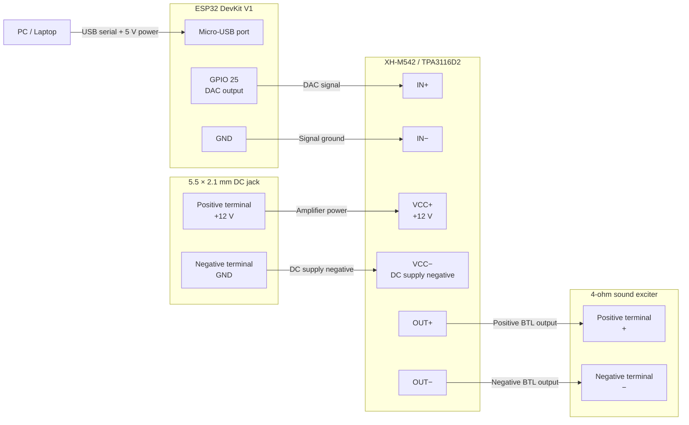

# Hardware implementation

- ESP32 DevKit V1 - microcontroller that receives telemetry from the PC through `get_telemetry.exe` and generates the control waveform
- TPA3116D2 - class D amplifier, drives the sound exciter
- Sound exciter - 4Ω 25W, resonance frequency ~60Hz - converts the amplified signal into physical vibration (see spec/frequency response note below)
- DC 12V 3A power supply - powers the amplifier
- 5.5mm x 2.1mm DC jack (female)

**Note:** The selected exciter has a rated frequency response of ~60Hz–20kHz (resonance frequency 60Hz ±20%), with SPL relatively stable between 20–150Hz and a dip around 300Hz–1kHz. Since target effects (e.g. ABS pulsing at 10–15Hz) fall below the exciter's effective operating range, a carrier-modulation approach was used instead of direct low-frequency playback (see Design Rationale).

## Hardware compatibility

This project requires a classic ESP32 with an internal DAC on GPIO 25.
ESP32-C3 and ESP32-S3 boards are not directly compatible with this firmware.

## Wiring diagram

> **BTL output warning:** `OUT−` is an active amplifier output, not ground.
> Connect the exciter only between `OUT+` and `OUT−`. Never connect either
> output terminal to ESP32 ground, USB ground, or power-supply ground.
> `VCC−` is the DC power-input negative terminal and must not be confused with
> the amplifier's `OUT−` speaker terminal.

## Calibrated operating limit

The output limit below was measured on the assembled system, not inferred from the amplifier's advertised maximum power:

- Amplifier board: XH-M542 / TPA3116D2 mono
- Power supply: 12 V DC, 3 A
- Exciter: nominal 4 ohm, marked 25 W
- Calibration signal: continuous 60 Hz sine wave
- Amplifier volume: maximum and unchanged between measurements
- Measurement point: directly across `OUT+` and `OUT-`, with the exciter connected

| Master gain | Measured output | Estimated power into nominal 4 ohm |
| ---: | ---: | ---: |
| `0.50` | 3.6 Vrms | 3.2 W |
| `0.70` | 5.2 Vrms | 6.8 W |
| `0.80` | 6.0-6.1 Vrms | 9.0-9.3 W |

The power estimates use:

$$P \approx \frac{V_{\text{RMS}}^2}{R}$$

Because 4 ohm is the exciter's nominal impedance and its actual impedance varies with frequency, these values are engineering estimates rather than laboratory power measurements.

For this exact hardware configuration, the calibrated continuous-output safety limit is:

$$
G_{\mathrm{master}} \le 0.80, \qquad
V_{\mathrm{OUT}} \le 6.1\,\mathrm{V_{RMS}}\quad\text{at 60 Hz}
$$

This corresponds to approximately 9.3 W using the nominal 4-ohm value. The 25 W marking is not used as a continuous sine-wave target: the exciter becomes noticeably warm during sustained resonant operation, and its exact continuous thermal rating is not documented. The amplifier board's advertised 100 W figure also does not apply to this 12 V / 3 A supply configuration.

The continuous 60 Hz calibration tone is a more severe thermal load than normal firmware output, where ABS is pulse-gated and multiple effects do not remain at their maximum allocations continuously. Even so, long-duration testing must be supervised. Stop immediately if temperature continues rising without stabilizing, vibration becomes distorted, or there is any smell from the coil, adhesive, wiring, or amplifier.

The TPA3116D2 output is BTL. Voltage must be measured between `OUT+` and `OUT-`; neither speaker terminal may be connected to ESP32 ground, USB ground, or power-supply ground. Attach meter probes with power off, select AC voltage mode, and never use resistance or current mode on an energized output.

