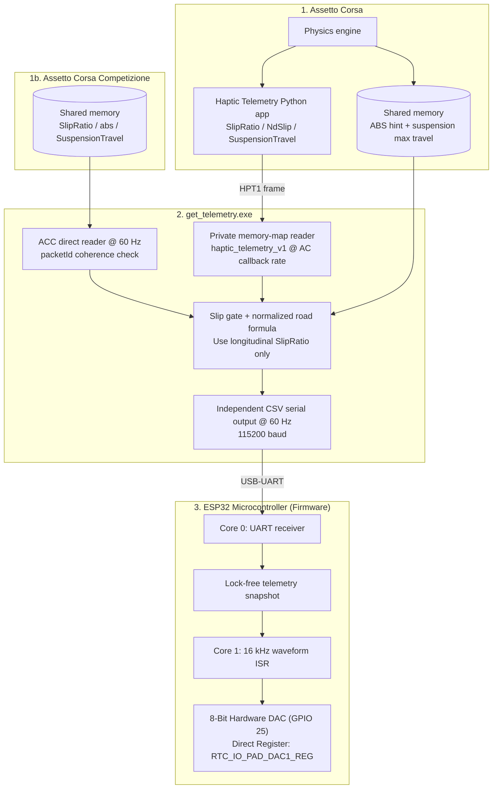

# Communication protocol

## End-to-end data flow



## Game bridges

### Assetto Corsa Python API bridge
The in-game app `assetto_corsa_python_app/haptic_telemetry` publishes the following `HPT1` fields through `haptic_telemetry_v1`:

| Field | Source | Usage |
|---|---|---|
| `brake` | `acsys.CS.Brake` | Gates all longitudinal brake-slip effects |
| `speedKmh` | `acsys.CS.SpeedKMH` | Suppresses low-speed telemetry noise |
| `slipRatio[FL, FR]` | `acsys.CS.SlipRatio` | ABS and lock-up detection |
| `ndSlip[FL, FR]` | `acsys.CS.NdSlip` | Diagnostic only; never drives the brake pedal |
| `suspensionTravel[FL, FR]` | `acsys.CS.SuspensionTravel` | Input to normalized suspension-velocity road effect |

`get_telemetry.exe` opens `Local\acpmf_physics` only for the ABS enabled/configuration hint and `Local\acpmf_static` for `suspensionMaxTravel`. It does not read shared-memory `wheelSlip` for haptic output.

### Assetto Corsa Competizione direct bridge

ACC is read directly from its extended `Local\acpmf_physics` page using the layout in `get_telemetry/structed_file_ACC.h`:

| Field | Usage |
|---|---|
| `brake`, `speedKmh` | Brake and low-speed gates |
| `slipRatio[FL, FR]` | Longitudinal slip feedback |
| `abs` | Native ABS intervention signal (`0.0` inactive, `1.0` active) |
| `suspensionTravel[FL, FR]` | Normalized road effect |

The reader checks `packetId` before and after copying a frame to reject torn shared-memory reads. ACC's legacy `wheelSlip` and unused `absInAction` fields are not used for haptic activation.


## USB serial protocol

### Packet format
Data is formatted as a CSV string and transmitted at **115200 baud, 8-N-1** over USB-UART.

```text
absVal,slipRatioFL,slipRatioFR,roadIntensityFL,roadIntensityFR\n
```

### Packet validation

1. Field count — Reject the packet unless the parser successfully extracts all five required telemetry values. 

2. `isfinite()` check - Rejects `NaN`, `+Inf`, `-Inf` values that can result from UART byte corruption (e.g., partial packet, electrical noise). This prevents invalid floating-point values from propagating into the waveform synthesis math, where they would cause undefined behavior or crash.

3. Range validation - Rejects packets unless `absVal` is in `0..1`, each longitudinal slip ratio is in `0..2.01`, and each normalized road intensity is in `0..1.001`.

### Timing and fail-safe

The host sends telemetry packets at 60 Hz. If simulator telemetry is stale for more than 250 ms, the host sends a zero-valued packet. If the ESP32 receives no valid telemetry packet for more than 500 ms, it zeros the telemetry snapshot
and silences the exciter.

Invalid packets and `ID?` requests do not refresh the ESP32 watchdog.


### Automatic ESP32 discovery and updater

The ESP32 has a stable eFuse MAC identifier. On every connection attempt, the PC app opens each available COM port with DTR/RTS disabled, sends the following request, and keeps only the port that returns the expected protocol prefix:

```text
PC   -> ID?\n
ESP32 -> HAPTIC_PEDAL,1,<12-digit-eFuse-MAC>,<firmware-version>\n
```
For example, `HAPTIC_PEDAL,1,00C4D2BD2A58, 1.01` is a valid wire response. This means COM port numbering may change after reconnecting USB without requiring the user to select a port manually. Also, this ID also allows the app to identify the firmware version currently installed on the board and determine whether an update is available.


