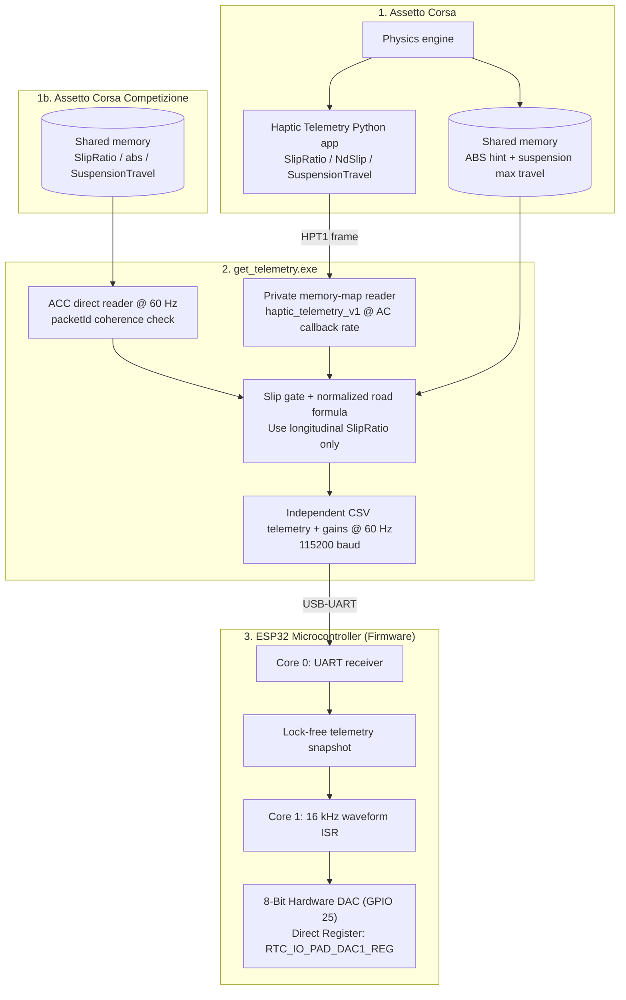

# Communication protocol

## End-to-end data flow


```mermaid
flowchart TD
    subgraph AC ["1. Assetto Corsa"]
        Physics["Physics engine"]
        Python["Haptic Telemetry Python app\nSlipRatio / NdSlip / SuspensionTravel"]
        AbsHint[("Shared memory\nABS hint + suspension max travel")]
        Physics --> Python
        Physics --> AbsHint
    end

    subgraph ACC ["1b. Assetto Corsa Competizione"]
        ACCPhysics[("Shared memory\nSlipRatio / abs / SuspensionTravel")]
    end

    subgraph Host ["2. get_telemetry.exe"]
        Bridge["Private memory-map reader\nhaptic_telemetry_v1 @ AC callback rate"]
        ACCReader["ACC direct reader @ 60 Hz\npacketId coherence check"]
        Gate["Slip gate + normalized road formula\nUse longitudinal SlipRatio only"]
        Serial["Independent CSV telemetry + gains @ 60 Hz\n115200 baud"]
        Bridge --> Gate --> Serial
        ACCReader --> Gate
    end

    subgraph ESP ["3. ESP32 Microcontroller (Firmware)"]
        UARTCore0["Core 0: UART receiver"]
        Snapshot["Lock-free telemetry snapshot"]
        TimerCore1["Core 1: 16 kHz waveform ISR"]
        DAC["8-Bit Hardware DAC (GPIO 25)\nDirect Register: RTC_IO_PAD_DAC1_REG"]
        UARTCore0 --> Snapshot --> TimerCore1
        TimerCore1 --> DAC
    end

    Python -->|"HPT1 frame"| Bridge
    AbsHint --> Gate
    ACCPhysics --> ACCReader
    Serial -->|"USB-UART"| UARTCore0
```

## Game bridges

### Assetto Corsa Python API bridge
The in-game app `assetto_corsa_python_app/haptic_telemetry` publishes the following `HPT1` fields through `haptic_telemetry_v1`:

| Field | Source | Usage |
|---|---|---|
| `brake` | `acsys.CS.Brake` | Gates all longitudinal brake-slip effects |
| `speedKmh` | `acsys.CS.SpeedKMH` | Suppresses low-speed telemetry noise |
| `slipRatio[FL, FR]` | `acsys.CS.SlipRatio` | ABS and lock-up detection |
| `ndSlip[FL, FR]` | `acsys.CS.NdSlip` | Diagnostic only; missing/invalid values become zero without interrupting feedback |
| `suspensionTravel[FL, FR]` | `acsys.CS.SuspensionTravel` | Input to normalized suspension-velocity road effect |

`get_telemetry.exe` opens `Local\acpmf_physics` only for the ABS enabled/configuration hint and `Local\acpmf_static` for `suspensionMaxTravel`. It does not read shared-memory `wheelSlip` for haptic output.

### Assetto Corsa Competizione direct bridge

ACC is read directly from its extended `Local\acpmf_physics` page using the layout in `get_telemetry/structed_file_ACC.h`:

| Field | Usage |
|---|---|
| `brake`, `speedKmh` | Brake and low-speed gates |
| `slipRatio[FL, FR]` | Longitudinal slip feedback |
| `abs` | Native ABS intervention signal (`0.0` inactive, `1.0` active) |
| `suspensionTravel[FL, FR]` | Normalized road effect |

The reader checks `packetId` before and after copying a frame to reject torn shared-memory reads. ACC's legacy `wheelSlip` and unused `absInAction` fields are not used for haptic activation.


## USB serial protocol

### Packet format
Data is formatted as a CSV string and transmitted at **115200 baud, 8-N-1** over USB-UART.

```text
absVal,slipRatioFL,slipRatioFR,roadIntensityFL,roadIntensityFR,masterGain,absGain,roadGain,slipGain\n
```

Firmware **1.04+** receives physical telemetry and four gains in `0..1`.
Individual gains scale their generated waveforms; master gain scales the combined
signal before adding the DAC midpoint. Volume settings do not change slip thresholds.

The host selects this nine-field packet from the complete firmware identity.
For older firmware it retains the legacy five-field packet with gains applied on
the host. Firmware 1.04 also accepts legacy five-field packets with unity gains.
Update both the app and firmware to get the corrected volume behavior.

Both game readers accept finite extreme slip ratios; the worker saturates their
absolute values at 2 before transmission. Diagnostic NdSlip is bounded to
`-100..100`; nonfinite diagnostics become zero. Nonfinite essential telemetry
still fails validation and cannot reach waveform synthesis.

### Packet validation

1. Field count — Accept exactly five legacy fields or nine fields with gains. Reject partial packets and trailing data. Bytes are accumulated until newline; fragmented USB delivery does not truncate a packet. Overlong lines are discarded through their newline.

2. `isfinite()` check - Rejects `NaN`, `+Inf`, `-Inf` values that can result from UART byte corruption (e.g., partial packet, electrical noise). This prevents invalid floating-point values from propagating into the waveform synthesis math, where they would cause undefined behavior or crash.

3. Range validation - Rejects packets unless `absVal` is in `0..1`, each longitudinal slip ratio is in `0..2.01`, each normalized road intensity is in `0..1.001`, and every supplied gain is finite and in `0..1`.

### Timing and fail-safe

The host sends telemetry packets at 60 Hz. If simulator telemetry is stale for more than 250 ms, the host sends a zero-valued packet. If the ESP32 receives no valid telemetry packet for more than 500 ms, it zeros the telemetry snapshot
and silences the exciter.

Invalid packets and `ID?` requests do not refresh the ESP32 watchdog.


### Automatic ESP32 discovery and updater

The ESP32 has a stable eFuse MAC identifier. On every connection attempt, the PC app opens each available COM port with DTR/RTS disabled, sends the following request, and keeps only the port that returns the expected protocol prefix:

```text
PC   -> ID?\n
ESP32 -> HAPTIC_PEDAL,1,<12-digit-eFuse-MAC>,<firmware-version>\n
```
For example, `HAPTIC_PEDAL,1,00C4D2BD2A58,1.04` is a valid wire response. The host waits for a complete line and validates the 12 hexadecimal MAC digits before accepting the identity. This means COM port numbering may change after reconnecting USB without requiring the user to select a port manually. The identity also allows the app to determine whether an update is available.


